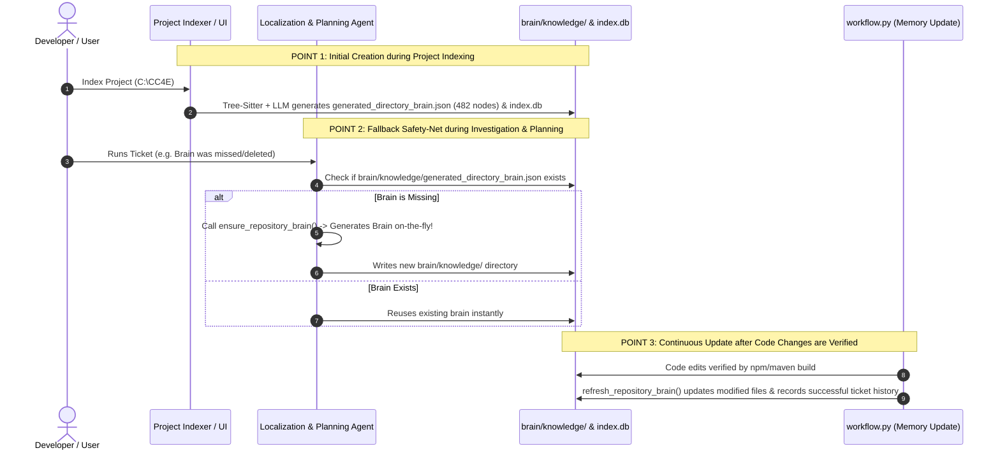

# 🏛️ Complete System Architecture & Repository Brain Lifecycle

This document details the complete end-to-end architecture of **Aviator**, featuring the **Two-Tiered Repository Brain Engine**, **Multimodal Ingestion Pipeline**, **Self-Healing Re-Loops**, and the **3-Stage Brain Creation, Fallback & Continuous Update Lifecycle**.

---

## 🧭 Complete Architecture Flow Diagram

```mermaid
flowchart TD
    %% Intake Phase
    subgraph INTAKE ["1. Intake & Multimodal Analysis"]
        U["👤 User Ticket Prompt<br>+ Attachments [Image 1, Image 2, Log 1]"] --> UI["💻 React Chatbot UI (App.jsx)"]
        UI --> CAT["📎 Sequential Categorizer<br>(Image 1, Image 2, Log 1)"]
        CAT --> VA["👁️ Visual Analyzer<br>(Gemini Multimodal LLM)"]
        VA --> EVI["📝 Evidence Synthesis<br>(Extracted UI States & Diagnoses)"]
    end

    %% Repository Brain Phase
    subgraph BRAIN ["2. Two-Tiered Repository Brain Engine"]
        EVI --> MACRO["📁 Tier 1: Macro Architecture Brain<br>(brain/knowledge/generated_directory_brain.json - 482 Nodes)"]
        MACRO -->|Microservice Boundaries & Intent| AST["🌳 Tier 2: AST & Knowledge Graph<br>(SQLite index.db: 39k Symbols | Neo4j: 41k Nodes, 191k Edges)"]
    end

    %% Core Pipeline Phase
    subgraph PIPELINE ["3. Autonomous Agent Pipeline (workflow.py)"]
        AST --> A1["🔍 Investigation & Triage Agent"]
        A1 --> A2["🧭 Architectural Localization Agent<br>(Safety Net: Checks & Bootstraps Brain if Missing!)"]
        A2 --> A3["📚 Hybrid RAG Engine (FTS5 + Graph)"]
        A3 --> A4["📋 Planning & Negative Constraint Gating"]
        A4 --> A5["💻 Surgical Code Generation Agent"]
        A5 --> A6["🧪 Verification & Compiler Build<br>(npm run build / maven / pytest)"]
    end

    %% Verification & Re-Loop Phase
    subgraph RELOOP ["4. Self-Healing Re-Loop & Feedback Engine"]
        A6 -->|❌ Build/Test Fails| DIAG["🔍 Self-Reflection & Diagnostic Agent<br>• Extracts Stack Traces & Compiler Errors<br>• Pinpoints Failing Syntax/Type Mismatches"]
        DIAG -->|🔄 Re-Loop 1: Auto-Fix Loop (Up to N Retries)| A4
        
        A6 -->|✅ Build/Test Passes| CP["👁️ Live Human Checkpoint UI<br>(Displays Transparent Plan & Diffs)"]
        CP -->|❌ User Requests Changes| HFEED["✍️ Human Feedback Collector"]
        HFEED -->|🔄 Re-Loop 2: Human Feedback Loop| A4
    end

    %% Persistence & Evolution Phase
    subgraph PERSISTENCE ["5. Memory Evolution & Brain Auto-Update"]
        CP -->|✅ User Approves| MEM["🧠 Memory Update & refresh_repository_brain()<br>(Learns newly modified files & updates brain/knowledge/)"]
        MEM --> PERS["💾 Trace Persistence (C:/aviator_traces/<TICKET_ID>/)"]
        PERS --> DONE["🎉 Ticket Successfully Solved & Closed"]
    end

    %% Styles
    classDef loopStyle fill:#fff3cd,stroke:#ffc107,stroke-width:2px,color:#856404;
    classDef successStyle fill:#d4edda,stroke:#28a745,stroke-width:2px,color:#155724;
    classDef failStyle fill:#f8d7da,stroke:#dc3545,stroke-width:2px,color:#721c24;

    class DIAG,HFEED loopStyle;
    class MEM,PERS,DONE successStyle;
```

---

## 🧠 Part 1: Brain Creation, Safety Fallback & Auto-Update Lifecycle



---

### 1️⃣ **Point 1: Initial Creation (During Indexing)**
* **When:** When you click **Index** or add a project (`C:\CC4E`).
* **Where:** Creates `C:\CC4E\brain\knowledge\generated_directory_brain.json` and `C:\CC4E\.aviator\index.db`.
* **What:** 
  * Parses all 2,092 source files with Tree-Sitter into 39,051 AST symbols and 191,482 Neo4j relationships.
  * LLM groups directories into 482 business capability nodes with technical roles and intent keywords.

---

### 2️⃣ **Point 2: Safety-Net Fallback (During Investigation / Localization / Planning)**
* **Code Reference:** `localization_agent.py` lines 99–115 & 3508–3514 (`_maybe_bootstrap_repository_brain` & `_infer_create_location`).
* **When:** If a project was never indexed, or if `brain/knowledge` was deleted or missed.
* **How it works:**
  ```python
  if not primary_brain_path.exists():
      from ticket_to_code.brain.generate_repository_brain import ensure_repository_brain
      summary = ensure_repository_brain(str(self.workspace_path), llm=self.llm)
  ```
* **Guarantee:** Localization and Planning **never crash or fail due to a missing brain**. They will automatically bootstrap and synthesize the brain on the fly before generating the plan!

---

### 3️⃣ **Point 3: Continuous Auto-Update (After Code Changes are Done)**
* **Code Reference:** `workflow.py` lines 5000–5015 (`MEMORY_UPDATE` Stage).
* **When:** Immediately after code generation and compiler verification (`npm run build` / tests) succeed.
* **How it works:**
  ```python
  # 1. Register successful ticket touch against modified files
  agents.localizer.repository_brain.record_successful_ticket(file_path)

  # 2. Refresh directory brain with incremental drift-aware cache
  from ticket_to_code.brain.generate_repository_brain import refresh_repository_brain
  brain_summary = refresh_repository_brain(str(agents.localizer.workspace_path), llm=agents.localizer.llm)
  ```
* **Result:** Any new files created, deleted, or modified are dynamically updated in `brain/knowledge/generated_directory_brain.json`, keeping the brain 100% synchronized for future tickets.
