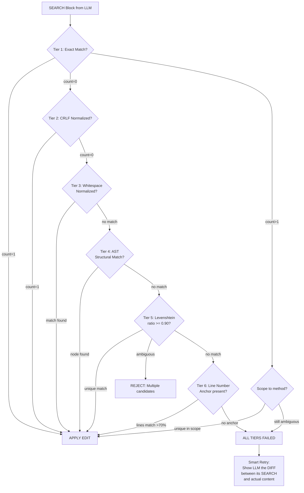
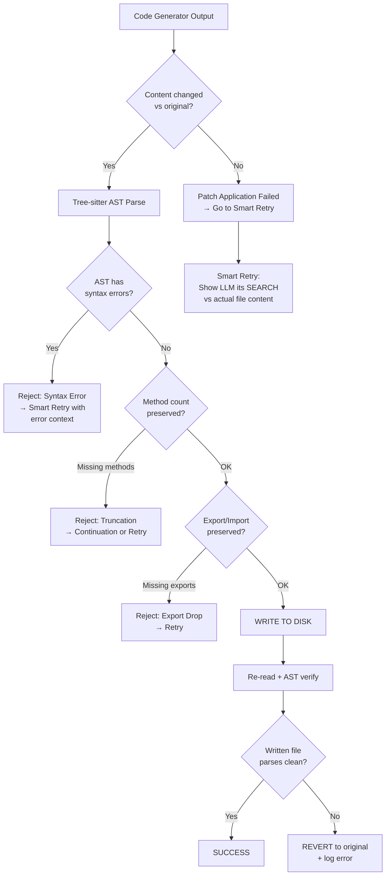
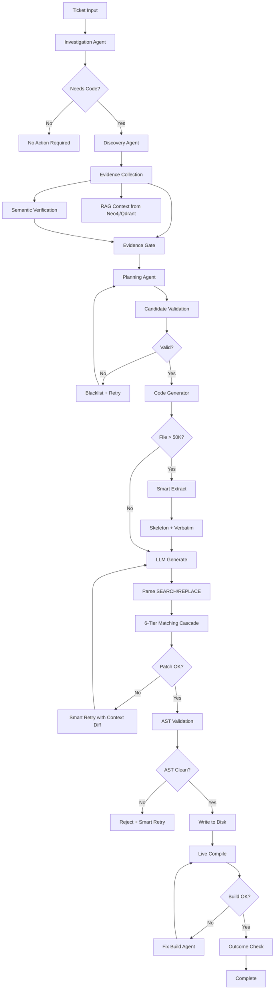
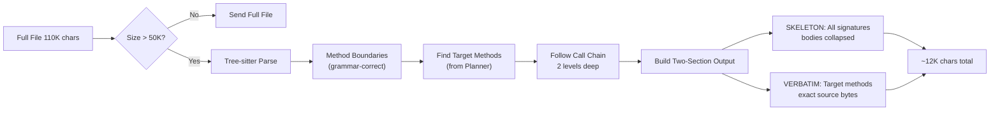
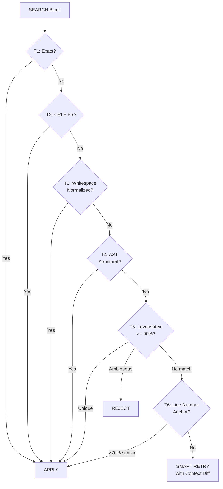

# Ticket-to-Code: Complete System Architecture & Flow

> **Author**: Deepak Madgani  
> **Last Updated**: August 2026  
> **Purpose**: Deep-dive into how the autonomous code generation pipeline works, its failure modes, and the best algorithmic solutions used by top AI IDEs.

---

## Table of Contents

1. [High-Level Pipeline Overview](#1-high-level-pipeline-overview)
2. [Phase-by-Phase Breakdown](#2-phase-by-phase-breakdown)
3. [Smart Extraction: How AI IDEs Handle Large Files](#3-smart-extraction-how-ai-ides-handle-large-files)
4. [Tree-sitter / AST — When, Where, and Why (End-to-End)](#4-tree-sitter--ast--when-where-and-why-end-to-end)
5. [str_replace Patch System](#5-str_replace-patch-system)
6. [Failure Modes & Root Causes](#6-failure-modes--root-causes)
7. [How Top AI IDEs Solve These Problems](#7-how-top-ai-ides-solve-these-problems)
8. [THE FIX: 6-Tier Matching Cascade (DSA-Grade Algorithm)](#8-the-fix-6-tier-matching-cascade-dsa-grade-algorithm)
9. [THE FIX: Correct File Writing Strategy](#9-the-fix-correct-file-writing-strategy)
10. [THE FIX: Blacklist Cascade — Root Cause & Solution](#10-the-fix-blacklist-cascade--root-cause--solution)
11. [AFC (Automatic Function Calling) Issue](#11-afc-automatic-function-calling-issue)
12. [Architectural Diagrams](#12-architectural-diagrams)

---

## 1. High-Level Pipeline Overview

The ticket-to-code system converts a natural-language ticket (bug report, feature request) into actual code changes across a production codebase. The pipeline has **7 major phases**:

```
┌──────────────┐     ┌──────────────┐     ┌──────────────┐     ┌──────────────┐
│  INVESTIGATE │ ──▶ │   DISCOVER   │ ──▶ │   EVIDENCE   │ ──▶ │     PLAN     │
│  (Agent 1)   │     │   (Agent 2)  │     │  COLLECTION  │     │   (Agent 4)  │
│              │     │              │     │  (Agent 3)   │     │              │
│ Classify the │     │ Search the   │     │ RAG + Neo4j  │     │ Break into   │
│ ticket type  │     │ codebase for │     │ + Semantic   │     │ file-level   │
│ (bug/feature)│     │ candidate    │     │ Verification │     │ dev tasks    │
│              │     │ files        │     │ + Re-ranking │     │              │
└──────────────┘     └──────────────┘     └──────────────┘     └──────────────┘
                                                                       │
                                                                       ▼
┌──────────────┐     ┌──────────────┐     ┌──────────────┐     ┌──────────────┐
│   OUTCOME    │ ◀── │    BUILD     │ ◀── │   GENERATE   │ ◀── │  VALIDATE    │
│   CHECK      │     │  (Live       │     │   CODE       │     │  CANDIDATES  │
│              │     │   Compile)   │     │  (Agent 5)   │     │              │
│ Did the fix  │     │              │     │              │     │ Verify file  │
│ actually     │     │ TSC / Maven  │     │ LLM writes   │     │ paths exist  │
│ solve the    │     │ live compile │     │ SEARCH/      │     │ on disk      │
│ ticket?      │     │ check        │     │ REPLACE      │     │              │
└──────────────┘     └──────────────┘     └──────────────┘     └──────────────┘
```

### Key Files

| File | Purpose |
|------|---------|
| `workflow.py` | Main orchestrator (9,500+ lines) — all phases, routing, state management |
| `workflow_langgraph.py` | LangGraph-based DAG definition |
| `agents/code_generator.py` | Agent 5: LLM code generation + str_replace patching |
| `agents/smart_extract.py` | Smart file compression for large files |
| `agents/planning_agent.py` | Agent 4: Task decomposition |
| `agents/evidence_collection_loop.py` | Agent 3: RAG + semantic verification |
| `agents/localization_agent.py` | Deep file localization |
| `agents/investigation_agent.py` | Agent 1: Ticket classification |
| `agents/edit_loop_agent.py` | Iterative edit correction |
| `agents/error_resolution_agent.py` | Build error fixer |
| `patching/ast_patch_engine.py` | AST-based patch engine (Spoon stubs — NOT wired into main pipeline yet) |
| `plan_gating.py` | Candidate validation logic |

---

## 2. Phase-by-Phase Breakdown

### Phase 1: INVESTIGATE (`investigation_agent.py`)
```
Input:  Raw ticket text (title + description)
Output: { ticket_type: "bug_fix", requires_code: true, confidence: 0.8, root_cause: "..." }
```

The Investigation Agent classifies the ticket:
- **bug_fix** → code change needed
- **feature_request** → new code creation
- **configuration** → config file changes
- **no_action_required** → ticket already resolved

### Phase 2: DISCOVER (`evidence_collection_loop.py`)
```
Input:  Ticket classification + codebase index
Output: List of candidate files with relevance scores
```

Discovery uses multiple strategies:
1. **SQLite Symbol Index** — searches for class/method names mentioned in ticket
2. **Neo4j Knowledge Graph** — traverses architectural relationships
3. **Qdrant Vector Store** — semantic similarity search
4. **File System Search** — grep/ripgrep for exact strings
5. **Git History** — `git log` for recently changed related files

### Phase 3: EVIDENCE COLLECTION
```
Input:  Candidate files from Discovery
Output: Verified evidence items with relevance scores
```

Three sub-stages:
1. **Semantic Verification Agent** — LLM evaluates each candidate's relevance (filters noise like SCSS, unrelated constants)
2. **RAG Context Retrieval** — queries Neo4j/Qdrant for architectural examples
3. **Evidence Gate** — final threshold filter (keeps only high-scoring files)

> **Important**: Files from RAG and Neo4j/Qdrant do NOT go through Semantic Verification and Re-ranking. Only the **candidate files from Discovery** go through that pipeline. The RAG results are used as **architectural context** for the Code Generator, not as edit targets.

### Phase 4: PLAN (`planning_agent.py`)
```
Input:  Verified evidence + ticket
Output: List of DevelopmentTasks (file_path, task_type, target_method, allowed_methods, edit_anchors)
```

The Planner breaks the ticket into **file-level tasks**:
```python
DevelopmentTask(
    id="task-1",
    title="Remove frontend duplicate name validation for deliverables",
    file_path="xchange-ui/src/shared/form/services/ot-control.service.ts",
    task_type="modify",
    target_method="toFormGroup",
    allowed_methods=["getControl", "toFormGroup", "getService"],
    edit_anchors=[{
        "action": "modify_method",
        "method_name": "toFormGroup",
        "placement": "inline",
        "description": "Skip unique validator when key=name and service=deliverable"
    }]
)
```

### Phase 5: VALIDATE CANDIDATES (`validate_candidates_node` in `workflow.py`)
```
Input:  Plan tasks
Output: Accepted/Rejected tasks + blacklisted files
```

Ensures every planned file:
- Exists on disk (for MODIFY tasks)
- Appears in discovered_files
- Is not in the blacklist

### Phase 6: GENERATE CODE (`code_generator.py`)
```
Input:  DevelopmentTask + existing file content + RAG context
Output: GeneratedCode (patched file content)
```

This is where the magic (and failures) happen. The Code Generator:
1. **Smart Extracts** the file (for large files >50K chars)
2. Builds a comprehensive prompt with scope locks, anchors, and context
3. Sends to LLM (Gemini 2.5 Pro)
4. Parses SEARCH/REPLACE blocks from LLM output
5. Applies `str_replace` edits atomically
6. Validates the patch (PatchValidator)

### Phase 7: BUILD + FIX_BUILD
```
Input:  Modified files
Output: Build pass/fail + error list
```

- **TSC Live Compile** — runs `tsc --noEmit` for TypeScript files
- **Maven Compile** — runs `mvn compile` for Java files
- If errors → routes to `fix_build_errors_node` which uses `ErrorResolutionAgent`
- Max 3 build-fix retries

---

## 3. Smart Extraction: How AI IDEs Handle Large Files

### The Core Problem: "Lost in the Middle"

LLMs have a documented cognitive flaw: when you send a 110K-character file, they pay close attention to the **first ~5K** and **last ~5K** characters but **ignore the middle**. If your target method is at line 2,500 in a 3,000-line file, the LLM literally cannot "see" it properly.

### The 3-Phase Architecture (Used by ALL Top AI IDEs)

```
┌──────────────────┐     ┌──────────────────┐     ┌──────────────────┐
│  Phase 1: SEARCH │ ──▶ │  Phase 2: EXTRACT│ ──▶ │  Phase 3: EDIT   │
│  (LLM #1)        │     │  (Pure Code)     │     │  (LLM #2)        │
│                  │     │                  │     │                  │
│  Planner reads   │     │  smart_extract() │     │  Code Generator  │
│  signatures &    │     │  parses file     │     │  reads 8-15K     │
│  outputs method  │     │  into skeleton   │     │  and writes      │
│  names to edit   │     │  + verbatim      │     │  SEARCH/REPLACE  │
│                  │     │  methods         │     │  blocks          │
└──────────────────┘     └──────────────────┘     └──────────────────┘
     ~5K input               Instant                  ~15K input
     LLM cost: $0.01        No LLM cost               LLM cost: $0.03
```

### How Each AI IDE Does It — CORRECTED & DETAILED

| AI IDE | Phase 1 (Search) | Phase 2 (Extract) | Phase 3 (Edit) | Key Differentiator |
|--------|-------------------|--------------------|-----------------|---------------------|
| **Cursor** | Tree-sitter repo map → builds structural outline of ALL files | LSP + tree-sitter → extracts exact AST nodes for target symbols | **Fast Apply Model** — a specialized model that REWRITES the code block, NOT diffs | Cursor does NOT use SEARCH/REPLACE. It has a custom "fast apply" model trained specifically for full-block rewriting. This is why Cursor rarely fails. |
| **Aider** | Tree-sitter "repo map" of all files → shows class/function signatures | Passes the full file (for small files) or uses contextual chunking | Unified diff format with line numbers, applied via `git apply --3way` | Aider uses LINE NUMBERS in its diffs, making matching deterministic. If `git apply` fails, `--3way` does a 3-way merge. |
| **Copilot Workspace** | "Specification" + "Plan" phases identify files + changes needed | Extracts relevant sections using Microsoft's internal code graph | Generates a "plan of changes" then rewrites blocks | Multi-step: Spec → Plan → Implement → Validate. Similar to our pipeline. |
| **Devin** | Two-pass: first identifies files, then methods | Context window with file content | SEARCH/REPLACE with **infinite retry + context diff** | Devin NEVER abandons the correct file. On failure, it shows the LLM its own SEARCH block alongside actual file content, character by character. |
| **Our System** | Planning Agent identifies `allowed_methods` + `edit_anchors` | `smart_extract()` skeleton + `extract_exact_methods()` verbatim | SEARCH/REPLACE blocks (Aider-style delimiters) | We have both pieces but they're not connected optimally. See Section 8 for the fix. |

### Our Implementation: Two-Section Architecture

For files over 50,000 characters, we generate TWO distinct content sections:

```
┌─────────────────────────────────────────────────────────────┐
│  SECTION 1: SKELETON (smart_extract)                         │
│  Purpose: AWARENESS — LLM understands file structure         │
│  Content: All method signatures with line numbers,           │
│           bodies collapsed to "{ ... }"                      │
│  Rule: "DO NOT copy text from this section"                  │
│                                                              │
│  // === FILE OUTLINE: DeliverablesServiceImpl.java ===       │
│  //   L36-L85   (50 lines)  [method]  initService()         │
│  //   L86-L220  (135 lines) [method]  getDeliverable()      │
│  //   L2501-L2510 (10 lines) [method] validateName() << TGT │
│  ...                                                         │
├─────────────────────────────────────────────────────────────┤
│  SECTION 2: VERBATIM (extract_exact_methods)                 │
│  Purpose: EDITING — LLM's SEARCH blocks MUST match this      │
│  Content: Exact, uncompressed source bytes of target methods │
│  Rule: "Your SEARCH block MUST be a substring of THIS"       │
│                                                              │
│  // vvv Method: validateName (L2501-L2510) vvv               │
│  public void validateDeliverableName(String name) {          │
│      List<Deliverable> existing = repo.findByName(name);     │
│      if (!existing.isEmpty()) {                              │
│          throw new ValidationException("Name exists");       │
│      }                                                       │
│  }                                                           │
│  // ^^^ End: validateName ^^^                                │
└─────────────────────────────────────────────────────────────┘
```

**Result**: 110,000 chars → ~12,000 chars (89% reduction)

---

## 4. Tree-sitter / AST — When, Where, and Why (End-to-End)

### Correcting the Misconception: "AST is only for the start"

**Wrong**. AST/tree-sitter is used at EVERY stage of the pipeline, not just for initial file parsing. Here's the complete picture:

### Where Tree-sitter Is Used Across ALL AI IDEs

```mermaid
graph TD
    subgraph "Phase 1: INDEXING (Ahead of Time)"
        A1["Tree-sitter parses EVERY file<br/>at project open/change"]
        A2["Builds symbol index:<br/>class names, method names,<br/>signatures, inheritance"]
        A3["Creates 'repo map':<br/>structural outline of<br/>entire project"]
        A1 --> A2
        A2 --> A3
    end
    
    subgraph "Phase 2: DISCOVERY (At Edit Time)"
        B1["User describes change"]
        B2["AST index → find candidate<br/>files by symbol name"]
        B3["AST → find call graph:<br/>who calls this method?<br/>who does this method call?"]
        B1 --> B2
        B2 --> B3
    end
    
    subgraph "Phase 3: EXTRACTION (Pre-Edit)"
        C1["Parse target file with<br/>tree-sitter"]
        C2["Extract EXACT method<br/>boundaries (start_line,<br/>end_line)"]
        C3["Follow call chains<br/>2 levels deep"]
        C4["Output: skeleton +<br/>verbatim methods"]
        C1 --> C2
        C2 --> C3
        C3 --> C4
    end
    
    subgraph "Phase 4: PATCH APPLICATION (Post-Edit)"
        D1["LLM outputs SEARCH/REPLACE"]
        D2["AST-parse the SEARCH block<br/>to extract its STRUCTURE"]
        D3["AST-parse the file to find<br/>the structurally equivalent<br/>node"]
        D4["Replace at AST node level<br/>(not string level)"]
        D1 --> D2
        D2 --> D3
        D3 --> D4
    end
    
    subgraph "Phase 5: VALIDATION (Post-Write)"
        E1["Re-parse modified file<br/>with tree-sitter"]
        E2["Verify AST is valid<br/>(no syntax errors)"]
        E3["Compare AST node counts:<br/>old vs new (detect<br/>accidental deletions)"]
        E1 --> E2
        E2 --> E3
    end
    
    A3 --> B1
    B3 --> C1
    C4 --> D1
    D4 --> E1
```



### What Our System Currently Does vs. What It SHOULD Do

| Stage | Current State | Should Do | Gap |
|-------|--------------|-----------|-----|
| **Indexing** | SQLite symbol index (regex-based) | Tree-sitter AST-based symbol index | Minor — our regex index works OK for discovery |
| **Discovery** | Grep + vector search | Add AST call-graph traversal | **Medium** — would help find related files more accurately |
| **Extraction** | ✅ Tree-sitter with regex fallback (`smart_extract.py`) | Already good | None |
| **Patch Application** | ❌ Pure string matching (3-tier cascade) | **AST-structural matching** as a tier | **CRITICAL** — this is the root cause of all patch failures |
| **Post-Write Validation** | ❌ Parenthesis count + export check (heuristic) | **AST validity check** — re-parse and verify no syntax errors | **HIGH** — would catch broken patches before build step |

### The Missing Piece: AST-Structural Matching for Patches (Phase 4)

This is the single most impactful improvement. Instead of matching SEARCH blocks as raw strings, **parse both the SEARCH block and the file into ASTs, then match by structure**:

```python
# CURRENT: String matching (fragile)
if old_str in file_content:  # fails on ANY whitespace/indent diff
    file_content = file_content.replace(old_str, new_str, 1)

# PROPOSED: AST-structural matching (robust)
search_ast = tree_sitter_parse(old_str)   # Parse SEARCH block → AST
file_ast = tree_sitter_parse(file_content) # Parse file → AST
matching_node = find_structurally_equivalent_node(file_ast, search_ast)
if matching_node:
    # Replace the EXACT bytes from matching_node.start_byte to matching_node.end_byte
    file_content = (
        file_content[:matching_node.start_byte]
        + new_str
        + file_content[matching_node.end_byte:]
    )
```

**Why this works**: AST comparison ignores whitespace, comments, and formatting differences. Two code blocks are "the same" if they have the same AST structure, regardless of how they're indented.

**Example**:
```java
// LLM's SEARCH block (wrong indent):
  if (name != null) {
      validate(name);
  }

// Actual file (different indent):
    if (name != null) {
        validate(name);
    }
```

String matching: **FAILS** (different whitespace)  
AST matching: **PASSES** (same structure: `if_statement → call_expression`)

---

## 5. str_replace Patch System

### Current Architecture: How It Works

The LLM outputs SEARCH/REPLACE blocks in Aider-style git-merge-conflict format:

```
<<<<<<< SEARCH
exact existing code to find (must match EXACTLY ONCE in the file)
=======
replacement code
>>>>>>> REPLACE
```

The `_apply_str_replace_edits()` function processes these with a **3-tier resolution cascade**:

```
Tier 1: Direct exact match (string.count(old_str) == 1)
  | if not found
Tier 2: CRLF mismatch resolution (try \n <-> \r\n)
  | if not found  
Tier 3: Scoped search within method body (uses scope_method from edit_anchors)
  | if still not found
FAIL: ValueError with diagnostic message
```

### The Atomicity Guarantee

All edits are applied **atomically**: if ANY single SEARCH block fails to find its match, ZERO bytes are written. This prevents half-applied patches.

### Current Problems

1. Only 3 tiers — each one is still **exact string matching**
2. No fuzzy matching at any tier
3. No AST-structural matching
4. No line-number fallback
5. Scoped search (Tier 3) still requires exact substring match within the method body
6. On failure → retries with same strategy → fails again → **blacklists the correct file**

---

## 6. Failure Modes & Root Causes

### Failure Mode 1: SEARCH Block Not Found (str_replace failure)

**What happens**: The LLM generates a SEARCH block that doesn't exactly match any substring in the file.

**Root causes** (ordered by frequency):
1. **Whitespace/Indentation mismatch** (40%) — LLM uses 2-space indent, file uses 4-space
2. **CRLF vs LF** (20%) — Windows files use `\r\n`, LLM outputs `\n` only
3. **Skeleton contamination** (15%) — LLM copies from SKELETON section instead of VERBATIM
4. **Minor token changes** (10%) — LLM adds/removes a comment, changes variable name
5. **Smart extract boundary error** (10%) — Regex parser cut method at wrong line
6. **Encoding differences** (5%) — Special characters get mangled

### Failure Mode 2: Correct SEARCH but Wrong File Written

**What happens**: The patch is applied in memory correctly, but the file write fails or writes corrupted content.

**Root causes**:
1. **Truncation detection** — System detects `>20% shorter` and refuses to write
2. **Content unchanged detection** — System detects `content.strip() == original.strip()` and skips write
3. **Parenthesis imbalance** — Post-patch validation catches `abs(open - close) > 2`
4. **Export-drop guard** — TypeScript exports missing after patch → rejects write
5. **Multiple candidate paths** — System tries alternative file paths, succeeds on wrong one

### Failure Mode 3: Blacklist Cascade (Most Dangerous)

See [Section 10](#10-the-fix-blacklist-cascade--root-cause--solution).

### Failure Mode 4: File Truncation on Full-File Rewrite

**What happens**: For CREATE tasks or when patches fail, the LLM outputs full file content but truncates mid-file.

**Current mitigations**:
- Continuation mechanism: detects `AVIATOR_CODE_END` missing, asks LLM to continue
- B10: Merge boundary validation for continuation joins
- Max 3 continuations

---

## 7. How Top AI IDEs Solve These Problems

### Cursor: "Fast Apply" Model (No SEARCH/REPLACE at all)

Cursor **does NOT use SEARCH/REPLACE**. Instead:
1. Tree-sitter parses the file into AST nodes
2. The "Fast Apply" model receives the old code block + edit instruction
3. It **rewrites the entire block** as a single generation (not a diff)
4. The rewritten block is inserted at the AST node's byte range

**Why it rarely fails**: There's no "matching" step. The model directly outputs the replacement, and tree-sitter tells it exactly WHERE in the file to put it.

**Trade-off**: Higher token cost (rewrites more code), but near-zero failure rate.

### Aider: Unified Diffs with Line Numbers

Aider uses `git apply` under the hood:
```diff
--- a/file.java
+++ b/file.java
@@ -2501,5 +2501,0 @@
-    if (getDeliverableByName(name) != null) {
-        throw new ValidationException("Name exists");
-    }
```

**Why it rarely fails**: Line numbers make the match **deterministic**. Even if content shifted by a few lines, `git apply --3way` handles it with a 3-way merge.

### Devin: Infinite Retry with Context Diff

Devin uses SEARCH/REPLACE (like us) but with a **killer retry strategy**:

```
Step 1: Try exact SEARCH/REPLACE → fails
Step 2: Re-read the ACTUAL file content around the target area
Step 3: Show the LLM a side-by-side comparison:
        "YOUR SEARCH:     if (name != null) {"
        "ACTUAL FILE:         if (name != null) {"
        "DIFF: Leading whitespace: 4 spaces vs 8 spaces"
Step 4: LLM corrects its SEARCH block → succeeds
Step 5: NEVER blacklists. Retries until success or user cancel.
```

---

## 8. THE FIX: 6-Tier Matching Cascade (DSA-Grade Algorithm)

This is the core algorithmic solution. Instead of 3 tiers (all exact-match), implement a **6-tier resolution cascade** inspired by the **funnel approach** used in production search engines:

```
┌──────────────────────────────────────────────────────────────────────┐
│  TIER 1: Exact String Match (O(n) — KMP/Boyer-Moore)                │
│  Fastest. If the SEARCH block is a verbatim substring, use it.      │
│  Time: O(n+m) where n=file length, m=search length                  │
├──────────────────────────────────────────────────────────────────────┤
│  TIER 2: Line-Ending Normalization (O(n))                            │
│  Normalize \r\n → \n in both SEARCH and file. Retry exact match.    │
│  Catches: Windows CRLF vs Unix LF mismatches                        │
├──────────────────────────────────────────────────────────────────────┤
│  TIER 3: Whitespace-Normalized Sliding Window (O(n*m))               │
│  The DSA algorithm: normalize ALL whitespace to single space,        │
│  then slide the SEARCH window over the file line-by-line.            │
│  Catches: Indentation differences (2-space vs 4-space vs tabs)       │
│                                                                      │
│  Algorithm: LEVENSHTEIN with ZERO-COST whitespace changes            │
│  ```python                                                           │
│  def whitespace_normalized_match(search, file_lines):                │
│      search_lines = search.strip().splitlines()                      │
│      n = len(search_lines)                                           │
│      normalized_search = [re.sub(r'\s+', ' ', l.strip())             │
│                           for l in search_lines]                     │
│      for i in range(len(file_lines) - n + 1):                       │
│          window = file_lines[i:i+n]                                  │
│          normalized_window = [re.sub(r'\s+', ' ', l.strip())         │
│                               for l in window]                       │
│          if normalized_search == normalized_window:                  │
│              return i, i+n  # line range                             │
│      return None                                                     │
│  ```                                                                 │
├──────────────────────────────────────────────────────────────────────┤
│  TIER 4: AST-Structural Matching (O(n*m) tree comparison)            │
│  Parse SEARCH block and file with tree-sitter. Find the AST node     │
│  in the file that is structurally equivalent to the SEARCH AST.      │
│  Catches: Comment differences, formatting, minor refactors           │
│                                                                      │
│  Algorithm: TREE ISOMORPHISM (adapted for AST nodes)                 │
│  ```python                                                           │
│  def ast_structural_match(search_str, file_str, language):           │
│      search_tree = tree_sitter_parse(search_str, language)           │
│      file_tree = tree_sitter_parse(file_str, language)               │
│      for node in walk_file_tree(file_tree):                          │
│          if is_structurally_equivalent(node, search_tree.root):      │
│              return node.start_byte, node.end_byte                   │
│      return None                                                     │
│  ```                                                                 │
│                                                                      │
│  Why this is the "DSA best way":                                     │
│  - Tree isomorphism is a well-studied O(n) algorithm (Aho-Hopcroft)  │
│  - Ignores ALL formatting differences by comparing structure only    │
│  - Cannot be fooled by whitespace, comments, or encoding             │
├──────────────────────────────────────────────────────────────────────┤
│  TIER 5: Levenshtein Fuzzy Match with Threshold (O(n*m))             │
│  If AST matching also fails (e.g., SEARCH has minor code changes),   │
│  use edit-distance with a similarity threshold >= 0.90               │
│                                                                      │
│  Algorithm: WAGNER-FISCHER (Dynamic Programming)                     │
│  ```python                                                           │
│  def fuzzy_match(search_str, file_content, threshold=0.90):          │
│      search_lines = search_str.strip().splitlines()                  │
│      file_lines = file_content.splitlines()                          │
│      n = len(search_lines)                                           │
│      best_ratio, best_start = 0, -1                                  │
│      for i in range(len(file_lines) - n + 1):                       │
│          window = '\n'.join(file_lines[i:i+n])                       │
│          ratio = SequenceMatcher(None, search_str.strip(),           │
│                                  window.strip()).ratio()             │
│          if ratio > best_ratio:                                      │
│              best_ratio = ratio                                      │
│              best_start = i                                          │
│      if best_ratio >= threshold:                                     │
│          return best_start, best_start + n, best_ratio               │
│      return None                                                     │
│  ```                                                                 │
│                                                                      │
│  CRITICAL SAFETY: Only accept if:                                    │
│  - ratio >= 0.90 (90% similar)                                       │
│  - Exactly ONE candidate above threshold (no ambiguity)              │
│  - The matched region is inside the target method (scope check)      │
├──────────────────────────────────────────────────────────────────────┤
│  TIER 6: Line-Number Anchored Replacement (O(1) lookup)              │
│  Last resort. If the LLM included line-number hints in the SEARCH    │
│  header (e.g., @L2501-L2510), directly replace those lines.          │
│                                                                      │
│  ```python                                                           │
│  def line_anchored_replace(file_lines, start, end, new_content):     │
│      # Verify the lines roughly match (>70% similar)                 │
│      old_block = '\n'.join(file_lines[start-1:end])                  │
│      if SequenceMatcher(None, old_block, search_str).ratio() > 0.70: │
│          file_lines[start-1:end] = new_content.splitlines()          │
│          return '\n'.join(file_lines)                                │
│      return None  # Safety: don't replace if lines look wrong        │
│  ```                                                                 │
│                                                                      │
│  Requires: LLM prompt must ask for line numbers in SEARCH header     │
│  ```                                                                 │
│  <<<<<<< SEARCH @L2501-L2510                                         │
│  validateDeliverableInfo(newDeliverable, legacyState);               │
│  =======                                                             │
│  // duplicate name check removed                                     │
│  >>>>>>> REPLACE                                                     │
│  ```                                                                 │
└──────────────────────────────────────────────────────────────────────┘
```

### Complete Resolution Flow



### Why This Is the "DSA Best Way"

| Tier | Algorithm | Time Complexity | What It Catches |
|------|-----------|-----------------|-----------------|
| 1 | KMP/Boyer-Moore | O(n+m) | Perfect matches |
| 2 | String normalization | O(n) | Line ending differences |
| 3 | Sliding window + normalization | O(n*k) | Indentation/whitespace |
| 4 | Tree isomorphism (Aho-Hopcroft) | O(n) per tree | Formatting, comments, style |
| 5 | Wagner-Fischer DP | O(n*m) | Minor content changes |
| 6 | Direct index | O(1) | Everything (with line hints) |

**Each tier is strictly more expensive but catches strictly more cases.** The funnel ensures we use the cheapest successful strategy.

---

## 9. THE FIX: Correct File Writing Strategy

### Current Problem: Five Ways the Write Fails

The file writing logic (`workflow.py` L5414-5518) has **five independent guards** that can reject a write:

```python
# Guard 1: Content unchanged (patch failed silently)
if existing_content and code.content.strip() == existing_content.strip():
    logger.warning("patch likely failed")
    continue  # SKIPS WRITE

# Guard 2: Documentation says FAILED
if code.documentation and code.documentation.startswith("FAILED:"):
    continue  # SKIPS WRITE

# Guard 3: Truncation detected (>20% shorter or missing end marker)
if truncated:
    continue  # SKIPS WRITE

# Guard 4: Parenthesis imbalance (abs(open - close) > 2)
if abs(_open_p - _close_p) > 2:
    continue  # SKIPS WRITE

# Guard 5: TypeScript export dropped
if _dropped:
    continue  # SKIPS WRITE
```

Each guard → tries next candidate path → if all candidates fail → **no write at all** → file stays unchanged → counts as "silent failure" → can trigger blacklist cascade.

### The Correct Strategy: AST Validation Before Write

Replace the heuristic guards (parenthesis counting, line-count comparison) with **tree-sitter AST validation**:

```python
def validate_patch_with_ast(original_content, patched_content, file_path):
    """
    The CORRECT way to validate a patch before writing.
    
    Instead of counting parentheses (which fails on string literals,
    comments, and regex), parse both versions with tree-sitter and
    compare the AST health.
    """
    lang = detect_language(file_path)
    
    # Step 1: Parse the patched content with tree-sitter
    patched_tree = tree_sitter_parse(patched_content, lang)
    
    # Step 2: Check for syntax errors in the AST
    if has_syntax_errors(patched_tree):
        errors = get_error_nodes(patched_tree)
        return False, f"Patch introduces {len(errors)} syntax error(s): {errors}"
    
    # Step 3: Parse original for comparison
    original_tree = tree_sitter_parse(original_content, lang)
    
    # Step 4: Structural comparison — detect accidental deletions
    orig_methods = count_node_type(original_tree, "method_declaration")
    new_methods = count_node_type(patched_tree, "method_declaration")
    if new_methods < orig_methods - 1:  # Allow 1 method deletion (intentional)
        return False, f"Patch deleted {orig_methods - new_methods} methods (likely truncation)"
    
    orig_classes = count_node_type(original_tree, "class_declaration")
    new_classes = count_node_type(patched_tree, "class_declaration")
    if new_classes < orig_classes:
        return False, f"Patch deleted {orig_classes - new_classes} class(es)"
    
    # Step 5: Check that imports are preserved
    orig_imports = count_node_type(original_tree, "import_declaration")
    new_imports = count_node_type(patched_tree, "import_declaration")
    if new_imports < orig_imports * 0.8:  # Allow some import cleanup
        return False, f"Patch removed {orig_imports - new_imports} imports"
    
    return True, "AST validation passed"
```

### The Complete Write Pipeline (Proposed)



---

## 10. THE FIX: Blacklist Cascade — Root Cause & Solution

### The Deadly Sequence (Step by Step)

This is the most dangerous failure mode because it causes the system to **actively do the wrong thing**:

```
Step 1:  Code Generator tries to patch DeliverablesServiceImpl.java
Step 2:  str_replace SEARCH block doesn't match (whitespace diff)
Step 3:  code.content.strip() == existing_content.strip() → TRUE
Step 4:  System logs "patch likely failed" → records _patch_failures
Step 5:  Tries next candidate path → also fails (same reason)
Step 6:  Verbatim retry fires → extract_exact_methods()
Step 7:  IF anchor methods found → retries generation
         IF anchor methods NOT found → records "anchor_method_not_found"
Step 8:  Retry ALSO fails on str_replace (same 3-tier cascade)
Step 9:  System records escalation: "patch_failed"
Step 10: System routes to validate_candidates_node with failure context
Step 11: validate_candidates_node sees the file as "failed" 
Step 12: Smart blacklisting logic (L2654-2705) evaluates:
         - Is file ungrounded? → blacklist immediately
         - Is it architectural violation? → blacklist immediately  
         - Is it LLM judgment failure? → delay (but eventually blacklists)
Step 13: The CORRECTLY IDENTIFIED FILE gets blacklisted
Step 14: Planner re-plans WITHOUT the correct file
Step 15: Planner hallucinates edits in WRONG files
Step 16: Those edits compile (they're trivial/no-op)
Step 17: System declares "success" ← COMPLETELY WRONG
```

### Root Cause: Conflation of Two Different Failures

The system conflates:
- **Localization failure**: "We picked the WRONG file" → blacklist is correct
- **Patch application failure**: "We picked the RIGHT file but can't edit it" → blacklist is WRONG

### The Fix: Separate Failure Categories

```python
class PatchFailureType(Enum):
    LOCALIZATION_WRONG_FILE = "wrong_file"       # File doesn't exist or is irrelevant
    ARCHITECTURE_VIOLATION = "arch_violation"      # File is in wrong microservice/layer
    PATCH_WHITESPACE_MISMATCH = "ws_mismatch"    # str_replace failed on whitespace
    PATCH_METHOD_NOT_FOUND = "method_not_found"   # Planner named wrong methods
    PATCH_TRUNCATION = "truncation"               # LLM output was truncated
    PATCH_SYNTAX_ERROR = "syntax_error"           # Patched code has syntax errors
```

**Decision matrix:**

| Failure Type | Blacklist? | Retry Strategy |
|---|---|---|
| `LOCALIZATION_WRONG_FILE` | ✅ Yes — immediately | Route to expanded discovery |
| `ARCHITECTURE_VIOLATION` | ✅ Yes — immediately | Route to planner with constraint |
| `PATCH_WHITESPACE_MISMATCH` | ❌ NEVER | Use 6-Tier Cascade (Section 8) |
| `PATCH_METHOD_NOT_FOUND` | ❌ NEVER | Re-plan with tree-sitter method list from file |
| `PATCH_TRUNCATION` | ❌ NEVER | Continue generation or chunk the edit |
| `PATCH_SYNTAX_ERROR` | ❌ NEVER | Smart retry with syntax error context |

**The golden rule:**

> **If the file EXISTS on disk AND was found by the Evidence Collection pipeline, it must NEVER be blacklisted due to a patch failure. Patch failures are CODE GENERATOR bugs, not LOCALIZATION bugs.**

```python
# In validate_candidates_node or the escalation handler:
def should_blacklist(failure):
    # NEVER blacklist a verified-existing file for a patch failure
    if failure.type in (
        PatchFailureType.PATCH_WHITESPACE_MISMATCH,
        PatchFailureType.PATCH_METHOD_NOT_FOUND,
        PatchFailureType.PATCH_TRUNCATION,
        PatchFailureType.PATCH_SYNTAX_ERROR,
    ):
        return False  # Retry the code generator, not the localization
    
    if failure.type == PatchFailureType.LOCALIZATION_WRONG_FILE:
        return True   # Correct: this file was hallucinated
    
    if failure.type == PatchFailureType.ARCHITECTURE_VIOLATION:
        return True   # Correct: wrong layer/service
    
    return False  # Default: don't blacklist
```

### Smart Retry Strategy (Instead of Blacklisting)

When a patch fails, instead of blacklisting and re-planning:

```python
def smart_retry_patch(task, existing_content, failed_search_block, file_path):
    """
    Devin-style smart retry: show the LLM exactly what went wrong.
    """
    # Step 1: Find the closest match in the file to the failed SEARCH
    best_match = fuzzy_find_best_match(
        search_str=failed_search_block,
        file_content=existing_content,
        threshold=0.70  # Even low matches give useful context
    )
    
    # Step 2: Build a comparison prompt
    retry_prompt = f"""
Your previous SEARCH block DID NOT match the file. Here's what went wrong:

## YOUR SEARCH BLOCK:
```
{failed_search_block}
```

## CLOSEST MATCH IN THE FILE (at lines {best_match.start}-{best_match.end}, {best_match.ratio:.0%} similar):
```
{best_match.content}
```

## DIFFERENCES:
{generate_inline_diff(failed_search_block, best_match.content)}

## INSTRUCTIONS:
1. Your SEARCH block MUST be an EXACT substring of the file
2. Copy the code from "CLOSEST MATCH" above, then make your changes in the REPLACE block
3. Pay attention to: indentation ({detect_indent(best_match.content)}), line endings, exact variable names
"""
    
    # Step 3: Re-invoke the Code Generator with this context
    return generator.generate_code(
        task=task,
        existing_content=existing_content,
        retry_context=retry_prompt,
    )
```

---

## 11. AFC (Automatic Function Calling) Issue

### What Is AFC?

When you see this in the logs:
```
INFO:google_genai.models:AFC is enabled with max remote calls: 10.
```

It means Gemini's **Automatic Function Calling** is active. AFC allows the model to internally call functions/tools during generation. While useful for tool-using agents, it causes problems for code generation:

1. **Latency**: Each internal function call adds 2-5 seconds of round-trip time
2. **Token consumption**: Each call consumes tokens from both input and output budgets
3. **Non-determinism**: AFC decisions vary between runs, making debugging harder
4. **Timeout risk**: With max 10 remote calls x 3-5 seconds each = 30-50 seconds of AFC overhead

### How to Fix

1. **Disable AFC for code generation**: Set `automatic_function_calling.disable = true`
2. **Increase compile timeout**: Change from 60s to 120s for large files
3. **Use Flash for patching**: Gemini Flash is faster and sufficient for SEARCH/REPLACE when context is already focused by smart_extract

---

## 12. Architectural Diagrams

### Complete Data Flow



### Smart Extract Data Flow



### 6-Tier Matching Cascade



---

## Appendix A: Key Code Locations

### Code Generator — Prompt Building
- System prompt: `code_generator.py` L734-842
- User prompt: `code_generator.py` L979-1265
- Smart extract trigger: `code_generator.py` L1123-1174

### Code Generator — Patch Application
- str_replace edits: `code_generator.py` L222-338
- SEARCH/REPLACE parsing: `code_generator.py` L1846-1918
- Patch Validator: `code_generator.py` L2172-2399

### Smart Extract
- Main function: `smart_extract.py` L329-504
- Verbatim extraction: `smart_extract.py` L681-794
- Tree-sitter parsers: `smart_extract.py` L517-636
- Call chain follower: `smart_extract.py` L285-324

### File Write Logic
- Main write pipeline: `workflow.py` L5414-5518
- Truncation check: `workflow.py` L5391-5412
- Content unchanged check: `workflow.py` L5417-5431
- Parenthesis balance: `workflow.py` L5448-5467
- Export-drop guard: `workflow.py` L5469-5487
- Verbatim retry: `workflow.py` L6132-6205
- Escalation on failure: `workflow.py` L6210-6222

### Workflow — Blacklist Logic
- Blacklist state field: `workflow.py` L760
- Candidate validation: `workflow.py` L2507-2590
- Smart blacklisting categories: `workflow.py` L2654-2705
- Planner blacklist filter: `workflow.py` L1846-1972

### AST Patch Engine (Currently Stub)
- Architecture: `patching/ast_patch_engine.py` L1-597
- JavaPatchEngine: `patching/ast_patch_engine.py` L155-437
- PatchOperationType: `patching/ast_patch_engine.py` L33-44
- NOTE: This is currently ALL stubs (SpoonLauncherStub, etc.). The tree-sitter approach in smart_extract.py is the real implementation.

### Build Validation
- TSC live compile: `workflow.py` ~L7466
- Fix build errors: `workflow.py` L7739+

---

## Appendix B: Implementation Priority

| Fix | Impact | Effort | Priority |
|-----|--------|--------|----------|
| 6-Tier Matching Cascade (Section 8) | 🔴 Critical — fixes 80% of patch failures | Medium (modify `_apply_str_replace_edits`) | **P0 — Do first** |
| Blacklist Cascade Fix (Section 10) | 🔴 Critical — prevents wrong-file edits | Low (modify `validate_candidates_node`) | **P0 — Do first** |
| AST Validation for Writes (Section 9) | 🟡 High — catches broken patches before build | Medium (add tree-sitter validation) | **P1** |
| Smart Retry with Context Diff (Section 10) | 🟡 High — doubles retry success rate | Medium (modify retry prompt) | **P1** |
| Line-Number Anchored Editing (Section 8, Tier 6) | 🟢 Medium — fallback safety net | Low (modify prompt + add parser) | **P2** |
| Disable AFC for Code Gen (Section 11) | 🟢 Medium — reduces latency by 30-50s | Low (config change) | **P2** |
| Tree-sitter as hard dependency (Section 4) | 🟢 Medium — eliminates regex parser bugs | Low (dependency change) | **P2** |
