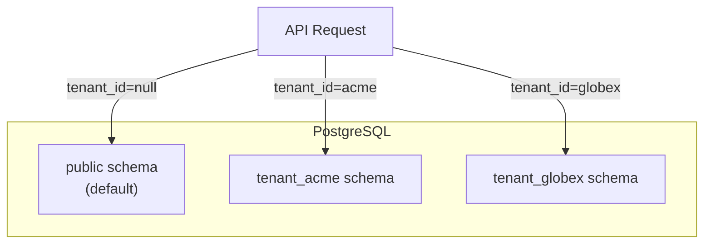
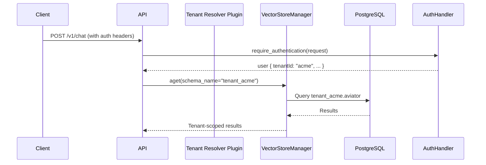

# Multi-Tenancy

Aviator ADT supports multi-tenancy through **PostgreSQL schema isolation**. Each tenant receives a dedicated schema containing its own vector store table and HNSW index. Records without a `tenant_id` fall back to the `public` schema, which serves as the default namespace for shared or unscoped data.

!!! info
    Multi-tenancy is controlled by the `MULTI_TENANT_ENABLED` environment variable (default: `true`). When disabled, all data is stored in the default schema regardless of any `tenantId` value.

## Architecture



### Schema Layout

Every schema has an **identical table structure** — the same tables with the same columns and indexes. The schema name is the isolation boundary, not a column filter.

| Schema | Table | Description |
|---|---|---|
| `public` | `aviator` | Default namespace for unscoped vector data |
| `public` | `usage_transactions` | Usage tracking detail rows (default tenant) |
| `public` | `usage_daily_tallies` | Aggregated daily usage tallies (default tenant) |
| `public` | `tenant_schema_map` | Maps `tenant_id` → `schema_name` (shared, usage tracking) |
| `tenant_acme` | `aviator` | Isolated vector data for tenant "acme" |
| `tenant_acme` | `usage_transactions` | Usage tracking detail rows for tenant "acme" |
| `tenant_acme` | `usage_daily_tallies` | Aggregated daily usage tallies for tenant "acme" |

### How It Works



#### Schema Resolution

The `tenantId` is resolved differently depending on the request type:

**Chat requests:**

1. The auth handler plugin (`aviator.auth_handlers`) authenticates the request and returns a `user` dict
2. ADT reads `user.get("tenantId")` — if absent, it defaults to `None`
3. ADT maps `tenant_id` → schema name: `tenant_{tenant_id}` (or `public` if `None`)

**Embedding requests:**

1. ADT reads `tenantID`, with the capital D, from the embedding request metadata (`request.metadata.get("tenantID")`)
2. The Celery worker resolves the schema name from the metadata value
3. If the tenant schema does not exist, the worker **auto-creates** it (schema + table + HNSW index)

#### Query Routing (RAG)

The RAG tool reads `tenant_id` from the LangGraph state, converts it to a schema name, and passes it to `VectorStoreManager.aget(schema_name=...)`. The similarity search only hits that tenant's HNSW index — **no cross-tenant leakage by design**.

#### Embedding Writes

When a new document is embedded via Celery, the `tenant_id` is carried in the request metadata. The worker resolves the correct schema and writes to that tenant's table.

#### Usage Tracking

The [Usage Tracking](usage_tracking.md) system follows the same schema isolation model. Each tenant's `usage_transactions` and `usage_daily_tallies` tables reside in their dedicated schema. Schemas are created on-demand when the first transaction is recorded for a tenant. A shared `tenant_schema_map` table in `public` maps `tenant_id` to schema names.

## Tenant Management API

!!! note
    The tenant management API is only available when both `MULTI_TENANT_ENABLED=true` and `TENANT_API_ENABLED=true`. Both flags must be enabled for these endpoints to be registered. `TENANT_API_ENABLED` defaults to `false`.

Tenants are managed via REST endpoints:

| Method | Endpoint | Description |
|---|---|---|
| `POST` | `/v1/tenants?tenant_id=acme` | Create tenant schema |
| `GET` | `/v1/tenants` | List all tenants |
| `GET` | `/v1/tenants/{tenant_id}` | Get tenant info |
| `DELETE` | `/v1/tenants/{tenant_id}` | Delete tenant and all data |

### Create a Tenant

```bash
curl -X POST "http://localhost:3000/v1/tenants?tenant_id=acme" \
  -H "auth-ticket: your-ticket"
```

This will:

1. Create PostgreSQL schema `tenant_acme`
2. Initialize the vector store table (`aviator`) with HNSW index
3. Verify the `PGVectorStore` can be instantiated

### Delete a Tenant

```bash
curl -X DELETE "http://localhost:3000/v1/tenants/acme" \
  -H "auth-ticket: your-ticket"
```

!!! warning
    Deleting a tenant drops the entire schema with `CASCADE`. **All data is permanently lost.**

## Providing a Tenant ID

The auth handler plugin must include a `tenantId` key in the returned user dict for tenant isolation to take effect. If `tenantId` is absent or `None`, the `public` schema is used.

### Auth Handler Example

```python
from fastapi import Request


def authenticate(request: Request) -> dict:
    """Authenticate the user and resolve the tenant."""
    # Your authentication logic...
    return {
        "login": "john.doe",
        "tenantId": "acme",  # <-- ADT reads this for schema isolation
    }
```

For WebSocket connections, the `user` dict is resolved the same way via `get_auth_handler_ws()`.

## Configuration

Multi-tenancy is controlled by the following environment variables:

| Variable | Default | Description |
|---|---|---|
| `MULTI_TENANT_ENABLED` | `true` | Enable schema-per-tenant isolation. When `false`, all data goes to the default schema. |
| `TENANT_API_ENABLED` | `false` | Enable the `/v1/tenants` CRUD REST API. Requires `MULTI_TENANT_ENABLED=true` to be meaningful. |
| `DEFAULT_SCHEMA` | `public` | The default PostgreSQL schema for unscoped data. |
| `TENANT_SCHEMA_PREFIX` | `tenant_` | Prefix for tenant schema names (e.g. `tenant_acme`). |
| `TENANT_ID_PATTERN` | `^[a-zA-Z0-9_-]{2,63}$` | Regex pattern to validate tenant identifiers. |

When `MULTI_TENANT_ENABLED=true`:

- Schema resolution maps `tenantId` → `{TENANT_SCHEMA_PREFIX}{tenant_id}`
- RAG queries check that the tenant schema exists before querying
- The Celery worker auto-creates tenant schemas on first embedding

When `MULTI_TENANT_ENABLED=false`:

- All data is stored in `DEFAULT_SCHEMA` (backward compatible)
- `tenantId` values are ignored

When `TENANT_API_ENABLED=true` (and `MULTI_TENANT_ENABLED=true`):

- The `/v1/tenants` management API is registered and available

When `TENANT_API_ENABLED=false` (default):

- The `/v1/tenants` endpoints are not registered

## Data Flow

### Chat Request

```
Client → POST /v1/chat
  → auth handler returns user { tenantId: "acme" }
  → Graph state: { tenant_id: "acme", ... }
  → RAG tool: vector_store.aget(schema_name="tenant_acme")
  → PostgreSQL: SELECT FROM tenant_acme.aviator WHERE ...
```

### Embedding Request

```
Client → POST /v1/embeddings (metadata: { tenantID: "acme" })
  → Celery task: process_embedding_request(request)
  → Worker reads tenant_id from request.metadata["tenantID"]
  → If tenant schema doesn't exist → auto-create it
  → vector_store.get(schema_name="tenant_acme")
  → PostgreSQL: INSERT INTO tenant_acme.aviator ...
```

## Key Design Decisions

| Decision | Rationale |
|---|---|
| Schema-level isolation | Stronger isolation than column filters; no accidental cross-tenant leakage |
| `public` as default | Backward compatible — existing deployments work without changes |
| `tenantId` from user dict (chat) | No extra plugin needed — auth handler already resolves the user's tenant |
| `tenantID` from request metadata (embeddings) | Decouples embedding writes from auth; clients control tenant routing |
| Auto-create tenant on first embed | No manual tenant provisioning required — schemas created on demand |
| Feature flag (`MULTI_TENANT_ENABLED`) | Opt-in isolation; backward compatible when disabled |
| Separate API flag (`TENANT_API_ENABLED`) | Keeps tenant CRUD endpoints disabled by default; decouples data isolation from API exposure |
| Cached per-schema stores | Avoids re-creating PGEngine on every request |
| `tenant_id` as string | Simple, flexible — auth handler controls what the ID looks like |
| Schema name derived by ADT | Consistent naming (`tenant_{id}`); auth handlers don't need to know schema internals |
