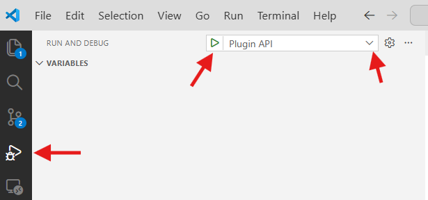
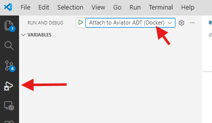
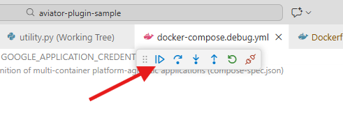
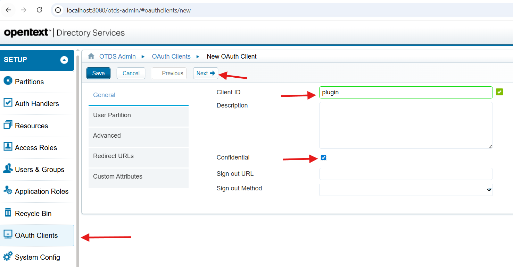

# Aviator Plugin Sample

## Plugin Development

Welcome to the Aviator Plugin Sample documentation! This is a complete example repository demonstrating how to create and register custom tools and Agents for the Aviator ADT.

This plugin uses a **base image + plugin pattern**:

```plain
┌─────────────────────────────────────┐
│   Aviator Base Image (ADT)          │
│   - Core Aviator functionality      │
│   - LangGraph runtime               │
│   - Database & message queue        │
└─────────────────────────────────────┘
              ↓ extends
┌─────────────────────────────────────┐
│   Your Plugin (this project)        │
│   - Custom tools and agents         │
│   - Plugin entry points             │
│   - Tool registration               │
└─────────────────────────────────────┘
```

### How It Works

1. **Base Image**: Contains the Aviator ADT with all core functionality
2. **Plugin Build**: Your Dockerfile extends the base image and installs your plugin
3. **Auto-Discovery**: Plugin tools are discovered via `pyproject.toml` entry points
4. **Runtime Integration**: Your tools become available to the AI agent

### Deployments
For details on deploying plugins with Aviator ADT, see [Plugin Deployment with Init Containers in Aviator ADT](initContainers.md).


### Prerequisite

Ensure that [Aviator-Plugin-Sample-Repo](https://gitlab.otxlab.net/csai/aviator-plugin-sample){:target="_blank"}  is cloned.
Please reach out to [Joe Piro](mailto:jpiro@opentext.com)  or [Patrick Pidduck](mailto:ppidduck@opentext.com)  to get access to the repo.

**Note**: See [Prerequisites](#prerequisites) section below for required software and tools.

### Credentials Required

You'll need a **Google credentials JSON file** named `otl-cs-csai.json` in the root directory of the project.  Please reach out to [Joe Piro](mailto:jpiro@opentext.com)  or [Patrick Pidduck](mailto:ppidduck@opentext.com) to get the file.

**Place Credentials File:**

   ```plain
   aviator-plugin-sample/
   ├─ otl-cs-csai.json    ← Place your Google credentials here
   ├─ .env
   ├─ docker-compose.yml
   └─ ...
   ```

### Quick Start

```bash
# Clone the repository
git clone git@gitlab.otxlab.net:csai/aviator-plugin-sample.git
cd aviator-plugin-sample

# Create .env file and add GOOGLE_APPLICATION_CREDENTIALS key
GOOGLE_APPLICATION_CREDENTIALS=./otl-cs-csai.json

# Run with Docker (builds plugin on top of Aviator base image)
docker compose -f docker-compose.dev.yml up --build

```

### Run and Debug

#### Local Setup

To debug the application using Visual Studio Code, you can use the predefined launch configurations.

* Make sure you have [Content Aviator ADT](https://gitlab.otxlab.net/csai/aviator_adt) repo cloned in the root folder of plugin repo. Add the path to Content Aviator ADT in plugin's pyproject.toml file.

``` yaml

[tool.uv.sources]
aviator = { path = "../aviator_adt", editable = true }

```

* Spin up the backend containers

```bash
docker compose -f docker-compose.yml up --build

#or

make up-backend

```

* Open the `Run and Debug` panel and select the `Plugin API` configuration.




Optional Software
If you want to build and start the chat interface locally:
```bash
npm ci
```


####  Docker Setup

##### Run

```bash
docker compose -f docker-compose.dev.yml up --build

#or

make up

```

##### Debug
Run the containers
```bash
docker compose -f docker-compose.debug.yml up --build

#or 

make debug
```

Attach Debugger to Docker containers from VS code






#### Test the API
curl http://localhost:3000/health

```

##### Debug
Run the containers
```bash
docker compose -f docker-compose.debug.yml up --build

#or 

make debug
```

Attach Debugger to Docker containers from VS code


#### Test the API
curl http://localhost:3000/health


### Dockerfile Structure

The plugin uses a multi-stage build:

```dockerfile
# Stage 1: Build the plugin
FROM aviator:latest as build
ADD . /plugins
WORKDIR /plugins
RUN uv build

# Stage 2: Install into base image
FROM aviator:latest
COPY --from=build /plugins/dist /plugins
RUN uv pip install /plugins/aviator_plugin_sample-*.tar.gz
```

You may need to update the path the latest version of aviator which can be found here: <https://artifactory.otxlab.net/artifactory/cs-csai-docker-dev/aviator/>{:target="_blank"}

**Key Benefits:**

- ADT already in base image - no need to copy source
- Clean separation between ADT and plugin
- Easy to update ADT version independently
- Plugin auto-discovered via entry points

## Entrypoints

The Content Aviator ADT (Agent Development Toolkit) supports extending it capabilities using a pluging mechanism using python package entrypoints. External packages that are installed in the same python environment can register objects (Classes, Callabels, Variables, ...) that injected into the ADT at runtime.

### Authentication Handlers

The name of the entrypoint **must** match the configured Content System of Content Aviator ADT. As multiple plugins can be installed, the permission check and the authentication are only performed for the configured Content System.

Find more resources for authentication here: [FastAPI Tutorial -> Security](https://fastapi.tiangolo.com/tutorial/security/){:target="_blank"}

#### API Key Authentication Example

Here's an example addition to the `pyproject.toml` of the plugin, this will apply for the Content_System "sample":

```

#### OAuth 2.0 Authentication Example

For OAuth 2.0 authentication with OTDS (OpenText Directory Services):

```toml
[project.entry-points."aviator.auth_handlers"]
"sample" = "aviator_plugin_sample.auth:get_auth_plugin"
```

Here's the complete OAuth 2.0 implementation from `auth.py`:

```python

# OAuth2 scheme definition
oauth2_scheme = OAuth2AuthorizationCodeBearer(
    authorizationUrl=OAUTH2_AUTHORIZE_URL,
    tokenUrl=OAUTH2_TOKEN_URL,
    scheme_name="OAuth2",
    auto_error=True,
)


async def get_auth_plugin(
    token: Annotated[str, Security(oauth2_scheme)]
) -> dict:
    """Authenticate user via OAuth2 token.
    
    This is the main auth handler called by Aviator for each request.
    """
    logger.info("OAuth authentication invoked")
    
    if not token:
        raise HTTPException(
            status_code=401,
            detail="Not authenticated",
            headers={"WWW-Authenticate": "Bearer"},
        )
    
    try:
        # Verify the token with OAuth provider
        token_data = await verify_token(token)
        
        # Return user information as dict
        user_info = {
            "username": token_data.username,
            "email": f"{token_data.username}@example.com"
        }
        
        return user_info
```

**Testing OAuth Authentication:**

```bash
# Get OAuth token
curl -X POST http://localhost:8080/otdsws/oauth2/token \
  -H "Content-Type: application/x-www-form-urlencoded" \
  -d "grant_type=client_credentials&client_id=<your_client_id>&client_secret=<your_client_secret>"

# Use token in chat request
curl -X POST http://localhost:3000/v1/chat \
  -H "Authorization: Bearer YOUR_TOKEN_HERE" \
  -H "Content-Type: application/json" \
  -d '{"messages": [{"author": "user", "content": "Hello"}]}'
```

!!! info "OTDS Configuration Required"
    Before using OAuth authentication, you need to set up an OAuth client in OTDS.
    See the complete [OTDS OAuth Client Setup Guide](#otds-oauth-client-setup-guide) below for step-by-step instructions.

### Startup Extensions

The pluging packages register objects for the entrypoints in their `pyproject.toml`.

Here's an example of registering a startup extension in the `pyproject.toml` of a plugin:

```toml
[project.entry-points."aviator.startup_extensions"]
"sample" = "aviator_plugin_sample.extensions:startup_extension"
```

In this example a background task is started upon startup as a thread to perform a set of predefined tasks asynchrounsly. In the example the `startup_knowledge_graph` method is started by the thread.

Startup extensions should go into the `extensions.py` file of the plugin:

```python
def startup_extension(**kwargs: dict[str, Any]) -> None:
    """List of steps to execute during Content Aviator startup."""

    logger.info("Starting Content Aviator plugin for Content Management...")
    threading.Thread(name="StartupKnowledgeGraph", target=startup_knowledge_graph).start()
```

### Tool Modifiers

Here's an example for registering a tool modifier in the pyproject.toml of a plugin:

```toml
[project.entry-points."aviator.tool_modifiers"]
"sample" = "aviator_plugin_sample.extensions:tool_extension"
```

#### Define Tool

Here's a real working example from `src/aviator_plugin_sample/holidays_canada.py`:

```python
""" Holidays Canada tool - Get holiday information for Canadian provinces."""

@tool
async def holidays_canada(
    province_id: ProvinceId,
    year: int | None = None
) -> str:
    """
    Get holiday information for a Canadian province.
    
    Use this tool when the user asks about holidays in Canada or a specific Canadian province.
    Returns information about all holidays in the province for the specified year,
    including the next upcoming holiday.
    
    Args:
        province_id: Two-letter province code (AB=Alberta, BC=British Columbia, 
                    MB=Manitoba, NB=New Brunswick, NL=Newfoundland and Labrador,
                    NS=Nova Scotia, NT=Northwest Territories, NU=Nunavut, 
                    ON=Ontario, PE=Prince Edward Island, QC=Quebec, 
                    SK=Saskatchewan, YT=Yukon)
        year: Optional year to get holidays for. Defaults to current year if not provided.
        
    Returns:
        Formatted string with holiday information including the next holiday
    """
    logger.info(f"Canadian holidays tool called for province: {province_id}, year: {year}")
    
    # Use current year if not specified
    if year is None:
        year = datetime.now().year
    
    # Build the API URL
    url = f"https://canada-holidays.ca/api/v1/provinces/{province_id}"
    params = {"year": year}
    
    try:
        async with httpx.AsyncClient() as client:
            response = await client.get(url, params=params, timeout=10.0)
            response.raise_for_status()
            data = response.json()
        
        # Extract province information
        province_data = data.get("province", {})
        province_name = province_data.get("nameEn", province_id)
        holidays = province_data.get("holidays", [])
        next_holiday = data.get("nextHoliday")
        
        # Format the response
        result_parts = [f"Holidays in {province_name} for {year}:"]
        
        if next_holiday:
            next_date = next_holiday.get("date")
            next_name = next_holiday.get("nameEn")
            result_parts.append(f"\n🎉 Next holiday: {next_name} on {next_date}")
        
        if holidays:
            result_parts.append(f"\n\nAll holidays ({len(holidays)} total):")
            for holiday in holidays:
                date = holiday.get("date")
                name = holiday.get("nameEn")
                result_parts.append(f"  - {name}: {date}")
        
        return "\n".join(result_parts)
        
    except Exception as e:
        logger.error(f"Error fetching holidays: {e}")
        return f"Error fetching holidays for {province_id}: {str(e)}"
```

#### Register a Tool

In `src/aviator_plugin_sample/extensions.py`:

```python
from .holidays_canada import holidays_canada

def tool_extension(
    tools: list,
    state: StateModel | None = None,
    config: RunnableConfig | None = None,
    **kwargs: dict[str, Any],
) -> None:
    """Register custom tools."""
    tools.append(holidays_canada)

```


#### Filter Tools

`tool_extension` allows you reduce the tool list depending on the configuration.
This is useful for adding or removing specific tools per user.

Any value added to the `user_info` returned by your auth handler is automatically available inside your tool extension via `config["configurable"]["user"]`. The value can be anything — a plain string, a list, a nested dict, or a signed token. A JWT is used in the example below because it provides an extra layer of security, but there is no requirement to use a JWT. You could equally store a simple list of allowed tool names or any other data structure that suits your use case.

For example, in your auth handler, include a signed payload with tool constraints called `filter_tools_jwt`:

```python
import jwt

filter_tools_jwt = jwt.encode(
    {
        "available_tools": ["greeting_tool", "holidays_canada"],
        "unavailable_tools": ["weather_fetcher"],
    },
    "secret",
    algorithm="HS256",
)

return {
    ...user_info,
    "filter_tools_jwt": filter_tools_jwt,
}
```

In `src/aviator_plugin_sample/extensions.py`:

```python
def tool_extension(
    tools: list,
    state: StateModel | None = None,
    config: RunnableConfig | None = None,
    **_kwargs: dict[str, Any],
) -> None:
    # Sample code to demonstrate dynamic tool filtering based on user configuration:
    # Assuming a JWT is attached to this user in the authentication handler
    custom_tools = [
        greeting_tool,
        weather_fetcher,
        holidays_canada
    ]
    user = config.get("configurable", {}).get("user") if config else None
    logger.info("Tool extension called with user: %s", user)

    if user and "filter_tools_jwt" in user:
        # Decode the JWT to get the filter configuration
        logger.info("Customizing tool filtering based on user configuration...")
        filter_tools_jwt = user.get("filter_tools_jwt")
        filter_tools_payload = jwt.decode(filter_tools_jwt, key=None, options={"verify_signature": False})
        available_tools = filter_tools_payload.get("available_tools") if filter_tools_payload else []
        unavailable_tools = filter_tools_payload.get("unavailable_tools") if filter_tools_payload else []

        # If available_tools is provided, keep only those tools (whitelist)
        if available_tools and len(available_tools) > 0:
            logger.info("Applying available filter, keeping only: %s", available_tools)
            custom_tools[:] = [tool for tool in custom_tools if tool.name in available_tools]
            logger.info("Kept %d tools from available list", len(custom_tools))

        # Remove tools whose name is in the unavailable_tools list (blacklist)
        if unavailable_tools and len(unavailable_tools) > 0:
            logger.info("Applying unavailable filter, removing: %s", unavailable_tools)
            custom_tools[:] = [tool for tool in custom_tools if tool.name not in unavailable_tools]

    tools.extend(custom_tools)
```

With the example above:

- Only `greeting_tool` and `holidays_canada` remain after allow-listing.
- `weather_fetcher` is explicitly removed.

This gives you per-user control over tool access without changing tool code.

#### Testing

```bash
# First, get an OAuth token (see OTDS OAuth Client Setup Guide below)
ACCESS_TOKEN=$(curl -s -X POST http://localhost:8080/otdsws/oauth2/token \
  -H "Content-Type: application/x-www-form-urlencoded" \
  -d "grant_type=client_credentials&client_id=YOUR_CLIENT_ID&client_secret=YOUR_CLIENT_SECRET" \
  | jq -r '.access_token')

# Then use the token in your chat request
curl -X POST http://localhost:3000/v1/chat \
  -H "Authorization: Bearer $ACCESS_TOKEN" \
  -H "Content-Type: application/json" \
  -d '{"messages": [{"author": "user", "content": "what are the holidays in Ontario this year?"}]}'
```

Response:

```json
{
  "result": "Holidays in Ontario for 2026:\n\n Next holiday: Family Day on 2026-02-16\n\nAll holidays (13 total):\n  - New Year's Day: 2026-01-01\n  - Family Day: 2026-02-16\n  - Good Friday: 2026-04-03\n  - Victoria Day: 2026-05-18\n  - Canada Day: 2026-07-01\n  - Civic Holiday: 2026-08-03\n  - Labour Day: 2026-09-07\n  - Thanksgiving: 2026-10-12\n  - Christmas Day: 2026-12-25\n  - Boxing Day: 2026-12-26",
  "context": "{\"thread_id\": \"...\", \"interrupt\": false}",
  "where": [],
  "references": []
}
```

### Graph Extensions

Here's an example graph extension in the `pyproject.toml` of a plugin:

```toml
[project.entry-points."aviator.graph_extensions"]
"sample" = "aviator_plugin_sample.extensions:graph_extension"
```

At this point you have full control to extend the Content Aviator Graph using LangGraph.
See the documentation for a full list of options: [LangGraph Graph-API](https://docs.langchain.com/oss/python/langgraph/graph-api){:target="_blank"}

In `src/aviator_plugin_sample/nodes.py`:

```python
def my_validation_node(state: Annotated[StateModel, InjectedState]):
    """
    Validate user input before processing.

    Args:
        state: Current conversation state with messages, context, etc.

    Returns:
        Modified state dictionary
    """
    logger.info("Validating user input")

    # Access the conversation state
    messages = state.messages  # List of messages
    query = state.query        # Current user query

    # Your validation logic here
    if len(query) > 1000:
        logger.warning("Query too long, truncating")
        return {"query": query[:1000]}

    # Return modified state or empty dict if no changes
    return {}
```

#### Register Node

In `src/aviator_plugin_sample/extensions.py`:

```python
def graph_extension(graph: StateGraph, **kwargs: dict[str, Any]) -> None:
    """Modify the conversation graph."""
    logger.info("Graph modification hook called")

    # Add your node
    graph.add_node("my_validation_node", my_validation_node)

    # Connect it to the conversation flow
    # Example: Add after assistant node
    graph.add_edge("assistant", "my_validation_node")

    logger.info("Graph modification complete")
```

Testing:

```bash
curl --request POST --url http://localhost:3000/v1/chat \
  --header 'Authorization: Bearer YOUR_ACCESS_TOKEN' \
  --header 'content-type: application/json' \
  --data '{"messages": [{"author": "user", "content": "test my validation"}]}'
```

### Prompt Modifiers

Here's an example for registering a prompt modifier in the `pyproject.toml` of a plugin:

```toml
[project.entry-points."aviator.prompt_modifiers"]
"sample" = "aviator_plugin_sample.extensions:prompt_extension"
```

In this exmaple we **extend** the *Assistant System Prompt* with additional instructions.

For this, the prompt modifier is added to the `extensions.py` file of the plugin:

```python
def prompt_extension(
    prompt_name: str,
    template: ChatPromptTemplate,
    state: StateModel | None = None,
    config: RunnableConfig | None = None,
    **kwargs: dict[str, Any],
) -> None:
    """Update the prompt templates."""

    match prompt_name:
        case "primary_assistant_prompt":
            system_message: SystemMessagePromptTemplate = next(
                (msg for msg in template.messages if isinstance(msg, SystemMessagePromptTemplate)), None
            )

            # Add custom instructions to the assistant prompt
            system_message.prompt.template += (
                "\n## Sample Plugin Custom Instructions\n\n"
                "You have access to the following custom tools from the sample plugin:\n"
                "- greeting_tool: Use for personalized greetings\n"

                " IMPORTANT Guidelines:\n"
                "1. When users ask for greetings, always use greeting_tool\n"
            )

        case _:
            pass
```

### Embedding Extensions

The embedding extension is called whenever documents are embedded into the vector database. This allows you to process document metadata and content during the embedding process.

Here's an example for registering an embedding extension in the `pyproject.toml` of a plugin:

```toml
[project.entry-points."aviator.embedding_extensions"]
"sample" = "aviator_plugin_sample.extensions:embedding_extension"
```

The embedding extension should be added to the `extensions.py` file of the plugin:

```python
def embedding_extension(
    request: EmbeddingRequest,
    is_metadata: bool,
    **kwargs: dict[str, Any],
) -> None:
    """Extend the embedding request to update the knowledge graph.

    This extension is triggered for each embedding request.
    We use it to update the knowledge graph when a workspace embedding is created/updated.

    Args:
        request (EmbeddingRequest): The embedding request containing document data
        is_metadata (bool): Whether the embedding is for metadata only
        **kwargs (dict[str, Any]): Additional keyword arguments
    """
    logger.info("Processing embedding extension")
    
    try:
        metadata = request.metadata or {}
        doc_id = metadata.get("document_id", metadata.get("documentID", "unknown"))
        doc_name = metadata.get("name", "Unknown Document")
        
        # Process the document - add to knowledge graph, extract entities, etc.
        kg = get_knowledge_graph()
        entity_id = f"doc_{doc_id}"
        kg.add_entity(entity_id, doc_name, "Document")
        
        logger.info(f"Processed document '{doc_name}' (ID: {doc_id})")
        
    except Exception as e:
        logger.error(f"Error processing embedding: {e}", exc_info=True)
```

**Use Cases:**
- Extract entities from document content and add to knowledge graph
- Process document metadata for custom indexing
- Trigger workflows based on document type
- Track document lineage and relationships

### Celery Task Imports

The celery_imports entry point allows you to register Celery tasks that run in the worker process. These tasks can be used for background processing, scheduled jobs, and async operations.

Here's an example for registering Celery tasks in the `pyproject.toml` of a plugin:

```toml
[project.entry-points."aviator.celery_imports"]
"sample_tasks" = "aviator_plugin_sample.tasks"
```

Define your tasks in `tasks.py`:

```python
import logging
from typing import Any, Dict
from celery import Celery
from aviator.models import EmbeddingRequest
from .knowledge_graph import get_knowledge_graph

logger = logging.getLogger(__name__)

# Get the Celery app instance
app = Celery('aviator-worker')

@app.task(name='sample.process_embedding')
def process_embedding_task(embedding_data: Dict[str, Any]) -> None:
    """Process an embedding request in the worker.
    
    This task is called when embeddings are processed.
    It extracts knowledge from the embedded content and updates the knowledge graph.
    
    Args:
        embedding_data: Dictionary containing embedding request data
    """
    try:
        logger.info("Processing embedding task")
        
        # Create EmbeddingRequest from the data
        request = EmbeddingRequest(**embedding_data)
        
        # Process the document and add to knowledge graph
        metadata = request.metadata or {}
        doc_id = metadata.get("documentID", f"doc_{id(request)}")
        doc_name = metadata.get("name", "Unknown Document")
        
        # Add document to knowledge graph
        kg = get_knowledge_graph()
        entity_id = f"doc_{doc_id}"
        kg.add_entity(entity_id, doc_name, "Document")
        
        logger.info(f"Added document to knowledge graph: {doc_name}")
        
    except Exception as e:
        logger.error(f"Error processing embedding task: {e}", exc_info=True)

```

**Use Cases:**
- Background document processing
- Scheduled data synchronization
- Async API calls to external services
- Batch operations on embeddings
- Long-running computations

**Testing Celery Tasks:**

```bash
# Check worker is running
docker compose ps aviator-worker

# View worker logs
docker compose logs -f aviator-worker

# Trigger embedding (which calls your task)
curl -X POST http://localhost:3000/v1/embed \
  -H "Authorization: Bearer YOUR_ACCESS_TOKEN" \
  -H "Content-Type: application/json" \
  -d '{
    "content": "Sample document content",
    "metadata": {"name": "test.txt", "documentID": "123"}
  }'
```

### Celery Beat Schedules

The `celery_beat_schedules` entry point allows plugins to register periodic tasks executed by the Celery beat scheduler. Each entry point must resolve to a callable that returns a `dict` of schedule definitions.

Register in `pyproject.toml`:

```toml
[project.entry-points."aviator.celery_beat_schedules"]
"my_schedules" = "aviator_plugin_sample.schedules:get_beat_schedules"
```

Define schedule definitions in your plugin:

```python
from celery.schedules import crontab


def get_beat_schedules() -> dict:
    """Return Celery beat schedule definitions.

    Returns:
        dict: Keys are schedule names, values are Celery beat schedule
        definitions with 'task', 'schedule', and optional 'args'/'kwargs'.
    """
    return {
        "sync-external-data": {
            "task": "aviator_plugin_sample.tasks.sync_external_data",
            "schedule": crontab(hour=3, minute=0),  # Daily at 03:00 UTC
        },
        "refresh-cache": {
            "task": "aviator_plugin_sample.tasks.refresh_cache",
            "schedule": crontab(minute="*/30"),  # Every 30 minutes
        },
    }
```

Plugin-contributed schedules are merged with ADT's built-in beat schedules (e.g., the usage tracking cleanup task). The worker must be started with the `-B` flag to enable the embedded beat scheduler.

**Use Cases:**

- Periodic data synchronization with external systems
- Cache warming or invalidation
- Scheduled cleanup or maintenance tasks
- Recurring report generation

### RAG Permission Filters

The name of the entrypoint **must** match the configured Content System of Content Aviator ADT. As multiple plugins can be installed, the permission check and the authentication are only performed for the configured Content System.

Here's how a RAG permission filter can be registered in the `pyproject.toml` file of the plugin:

```toml
[project.entry-points."aviator.rag_permission_filters"]
"sample" = "aviator_plugin_sample.auth:sample_permission_filter"
```

#### API Key Permission Filter Example

Here's an example permission filter for API key authentication:

```
#### OAuth Permission Filter Example

For OAuth 2.0 with OTDS, add to `pyproject.toml`:

```toml
[project.entry-points."aviator.rag_permission_filters"]
"sample" = "aviator_plugin_sample.auth:sample_permission_filter"
```

Here's the OAuth permission filter implementation from `auth.py`:

```python

def sample_permission_filter(chunks: list[Chunk], user: dict) -> list[Chunk]:
    """Filter chunks based on user authorization.

    Args:
        chunks (list[Chunk]): List of chunks to filter.
        user (dict): User information containing 'authorization'.

    Returns:
        list[Chunk]: Filtered list of chunks (all if admin, empty otherwise).

    """
    if not chunks:
        logger.debug("sample_permission_filter: No chunks to filter.")
        return []

    logger.debug("sample_permission_filter: Filtering chunks for user '%s'", user)

    # If user is admin, return all chunks; otherwise filter everything
    if user.get("authorization") == "admin":
        logger.debug("sample_permission_filter: Admin user, returning all chunks.")
        return chunks
    else:
        logger.debug("sample_permission_filter: Non-admin user, filtering all chunks.")
        return []
```

**Testing the Permission Filter:**

The permission filter is automatically invoked when RAG retrieval returns document chunks. To test:

1. Insert test documents into the vector database
2. Query via chat with authentication
3. Monitor logs for permission filter invocation


```python
# Extract document IDs
doc_ids = [chunk.metadata.get("document_id") for chunk in chunks]

# Call OTDS permission API
allowed_docs = check_otds_permissions(username, doc_ids)

# Filter chunks
filtered = [c for c in chunks if c.metadata.get("document_id") in allowed_docs]
return filtered
```

### RAG Metadata Retrievers

RAG Metadata Retrievers allow you to enrich document chunks with additional metadata from your content system. This metadata is fetched after permission checks and attached to each chunk before being presented to the LLM.

**When to use:** When you want to provide document-level metadata (title, type, author, etc.) to enhance the LLM's context understanding.

The name of the entrypoint **must** match the configured Content System of Content Aviator ADT.

#### Configuration

1. **Enable in settings** - Set `ADD_DOC_METADATA_TO_CONTEXT=true` in your environment
2. **Register plugin** - Add entry point in `pyproject.toml`:

```toml
[project.entry-points."aviator.rag_metadata_retrievers"]
"sample" = "aviator_plugin_sample.auth:fetch_document_metadata"
```

#### Implementation Example

The metadata retriever receives a user object and list of document IDs, and returns a dictionary mapping document IDs to their metadata:

```python
def fetch_document_metadata(user: dict, document_ids: list[str]) -> dict[str, dict]:
    """Fetch document-level metadata from the content system.

    Args:
        user: User information for authentication
        document_ids: List of document IDs to fetch metadata for

    Returns:
        Dictionary mapping document_id to metadata dict
        Example: {
            "12345": {"title": "Q4 Report", "type": "PDF", "author": "John Doe"},
            "67890": {"title": "Design Doc", "type": "Word", "author": "Jane Smith"}
        }

    """
    logger.info("Fetching metadata for %d documents", len(document_ids))
    
    metadata_map = {}
    
    for doc_id in document_ids:
        # Call your content system API to fetch metadata
        # This is just an example - replace with actual API call
        metadata = {
            "title": f"Document {doc_id}",
            "type": "Document",
            "created_date": "2024-01-01",
            "author": "Unknown"
        }
        metadata_map[doc_id] = metadata
    
    return metadata_map
```

#### How It Works

1. RAG search retrieves relevant chunks from vector store
2. Permission filters remove unauthorized chunks (if configured)
3. **Metadata retriever fetches document-level metadata** for remaining chunks
4. Metadata is attached to each chunk's `metadata` field
5. Chunks with metadata are serialized to JSON and sent to LLM

#### Example Chunk Output

When metadata is attached, chunks are serialized with the metadata field:

```json
{
  "CHUNK_ID": "chunk_123",
  "DOCUMENT_ID": "12345",
  "WORKSPACE_ID": "workspace_1",
  "CHUNK_CONTENT": "This is the document content...",
  "distance": 0.23,
  "start_index": 100,
  "metadata": {
    "title": "Q4 Report",
    "type": "PDF",
    "author": "John Doe",
    "created_date": "2024-01-01"
  }
}
```

#### Best Practices

- **Batch fetching:** Fetch metadata for all documents in one API call when possible
- **Error handling:** Return empty dict `{}` on errors rather than raising exceptions
- **Performance:** Cache metadata if your content system allows it
- **Security:** Respect user permissions when fetching metadata
- **Consistency:** Return consistent metadata structure across all documents

### Routers

To add an additional REST API endpoint you have to edit the `pyproject.toml` of your plugin:

```toml
[project.entry-points."aviator.routers"]
"sample" = "aviator_plugin_sample.extensions:router"
```


Add the following code to `extensions.py` of the plugin to create a GET **/test** endpoint:

```python

router = APIRouter()

@router.get("/test", tags=["test"])
async def test_endpoint() -> JSONResponse:
    """Test endpoint to verify the plugin is working."""
    return {"status": "Content Aviator plugin is operational."}
```

**Testing the endpoint:**

```bash
curl http://localhost:3000/test \
  -H "Authorization: Bearer YOUR_ACCESS_TOKEN"
```

Response:
```json
{"status": "Content Aviator plugin is operational."}
```

## Agents

If you want to create you own agents with tools and make them available to the `assistant` you need to take the following steps:

- define the tools
- create the agent (using the prebuilt `create_agent` from [langgraph](https://docs.langchain.com/oss/python/releases/langchain-v1#create-agent){:target="_blank"})
- create/copy a call function fo the agent
- register the call function as tool with the `assistant`

### Define a Tool

```python

@tool
def calculator(calculation: CalculationInput) -> CalculationResult:
    """Perform basic mathematical operations on two numbers.

    Args:
        calculation: CalculationInput model containing operation, x, and y values

    Returns:
        CalculationResult with operation details and result
    """
    operations = {
        "add": lambda a, b: a + b,
        "subtract": lambda a, b: a - b,
        "multiply": lambda a, b: a * b,
        "divide": lambda a, b: a / b,
    }
    
    result = operations[calculation.operation](calculation.x, calculation.y)
    symbols = {"add": "+", "subtract": "-", "multiply": "x", "divide": "÷"}
    expression = f"{calculation.x} {symbols[calculation.operation]} {calculation.y} = {result}"
    
    return CalculationResult(
        operation=calculation.operation,
        input_x=calculation.x,
        input_y=calculation.y,
        result=result,
        expression=expression,
    )
```


### Create Agent

```python
utility_agent = create_agent(
    model=LLMRegistry.get_model(with_provider=True),
    tools=[calculator],
    state_schema=StateModel,
    middleware=[after_agent],
)
```

### Create caller function

```python
@tool(response_format="content_and_artifact")
async def call_utility_agent(
    query: str,
    state: Annotated[StateModel, InjectedState],
    tool_call_id: Annotated[str, InjectedToolCallId],
) -> tuple[str, dict]:
    """
    Utility helper agent with calculator.

    Use this when the user asks for calculations.
    """
    logger.info(f"Utility agent called with query: {query}")

    try:
        # Create system message
        system_msg = SystemMessage(
            content="You are a helpful assistant. Use your tools to answer questions."
        )

        # Call the utility agent
        result = await utility_agent.ainvoke({
            "messages": [system_msg, HumanMessage(content=query)]
        })

        # Get the response
        response = result["messages"][-1].content

        # Return the result
        return Command(
            update={
                "messages": [
                    ToolMessage(
                        content=response,
                        tool_call_id=tool_call_id,
                    )
                ]
            }
        )

    except Exception as e:
        logger.error(f"Error in utility agent: {e}")
        return Command(
            update={
                "messages": [
                    ToolMessage(
                        content=f"Error: {str(e)}",
                        tool_call_id=tool_call_id,
                    )
                ]
            }
        )
```

#### Register the caller function with the `assistant`

In `src/aviator_plugin_sample/extensions.py`:

```python
from .utility import call_utility_agent

def tool_extension(
    tools: list,
    state: StateModel | None = None,
    config: RunnableConfig | None = None,
    **kwargs: dict[str, Any],
) -> None:
    """Register tools including agents."""

    tools.append(call_utility_agent)  # Register agent as tool
```

#### Agent Testing

```bash
curl --request POST --url http://localhost:3000/v1/chat \
  --header 'Authorization: Bearer YOUR_ACCESS_TOKEN' \
  --header 'content-type: application/json' \
  --data '{"messages": [{"author": "user", "content": "what is 5+2?"}]}'
```

---

## Demo

Watch a demonstration of the Aviator Plugin in action:

[▶️ Watch the Aviator Plugin Demo (OpenText Stream)](https://opentextcorporation.sharepoint.com/:v:/s/ContentServicesandLLM/IQARQiVJK1IMRJ6FH7XeuvxyARK_33vKq9B-sDcWslX9Lp8?e=efjwan){:target="_blank"}

## Observability

[See this section for observability setup and monitoring in AKS and local environments.](deployments.md#observability-for-lob-teams-aks){:target="_blank"}


----
## Testing

### Quick Start

```bash
# Run tests locally
make test

# Run tests in Docker
make test-docker

```


### Example Test Case

**Test: Calculator Tool Addition**

File: `tests/test_tools.py`

```python
import pytest
from aviator_plugin_sample.utility import calculator
from aviator_plugin_sample.models import CalculationInput

def test_calculator_addition():
    """Test calculator tool with addition operation."""
    # Arrange: Create input with operation and numbers
    calc_input = CalculationInput(operation="add", x=10, y=5)
    
    # Act: Invoke the calculator tool
    result = calculator.invoke(calc_input)
    
    # Assert: Verify the result
    assert result == 15, f"Expected 15, got {result}"
    assert isinstance(result, (int, float))
```

**Run Commands:**

```bash
# Run ALL test cases
pytest tests/ -v

# Run ONE specific test case
pytest tests/test_tools.py::test_calculator_addition -v

# Run with Docker (recommended)
# All tests:
make test-docker

# One specific test:
docker compose -f docker-compose.test.yml run --rm test pytest tests/test_tools.py::test_calculator_addition -v
```

----

## OTDS OAuth Client Setup Guide

This section provides complete instructions for configuring OpenText Directory Services (OTDS) as your OAuth 2.0 authorization server.

### Setting up OTDS Server

OpenText Directory Services (OTDS) is used as the OAuth 2.0 authorization server for the demonstration of authentication. The OTDS server is included in the Docker Compose stack.

**OTDS Configuration:**

- **URL**: http://localhost:8080/otdsws
- **Admin Console**: http://localhost:8080/otds-admin
- **Default Credentials**: `Admin` / `Livelink1!`

### Creating an OAuth Client in OTDS

To use OAuth authentication with your Aviator plugin, you need to create an OAuth client in OTDS:

* Step 1: Access OTDS Admin Console: Navigate to http://localhost:8080/otds-admin -> Login with credentials: `Admin` / Livelink1!` -> Go to **Configure** → **OAuth Clients**

* Step 2: Create New OAuth Client:

**IMPORTANT**: Copy and save the Client Secret immediately - it won't be shown again




### Using Client Credentials in Your Plugin

#### Update auth.py Configuration

Add your OTDS OAuth credentials to `src/aviator_plugin_sample/auth.py`:

```python
# OAuth2 configuration
OAUTH2_AUTHORIZE_URL = "http://localhost:8080/otdsws/oauth2/authorize"  # Browser access
OAUTH2_TOKEN_URL = "http://otds_server:8080/otdsws/oauth2/token"       # Backend container access
CLIENT_ID = "plugin"                                          # Your Client ID
CLIENT_SECRET = "W03nBTcA0g0zU1h9Cg6xoB8bJwrV0t2Y"            # Your Client Secret
```


### Generating OAuth Tokens

#### Method 1: Client Credentials Grant (API-to-API)

Use this for server-to-server authentication without user interaction:

```bash
# Get access token
curl -X POST http://localhost:8080/otdsws/oauth2/token \
  -H "Content-Type: application/x-www-form-urlencoded" \
  -d "grant_type=client_credentials" \
  -d "client_id=plugin" \
  -d "client_secret=W03nBTcA0g0zU1h9Cg6xoB8bJwrV0t2Y"

# Response
{
  "access_token": "eyJhbGciOiJSUzI1NiIs...",
  "token_type": "Bearer",
  "expires_in": 3600
}
```

#### Method 2: Authorization Code Grant (User Authentication)

Use this for user-facing applications where users log in and grant access:

**Step 1: Configure OAuth Client with Redirect URI**


In OTDS Admin Console, edit your OAuth client and add:

- **Redirect URI**: `http://localhost:3000/oauth/callback` (or your callback URL)

**Step 2: Get Authorization Code**

Direct the user to the authorization URL (open in browser):
Login with Admin/Livelink1! if required
```
http://localhost:8080/otdsws/oauth2/auth?response_type=code&client_id=plugin&redirect_uri=http://localhost:3000/oauth/callback
```

**Step 3: Exchange Authorization Code for Token**

```bash
# Extract the authorization code from the redirect URL
AUTHORIZATION_CODE="paste_code_from_redirect_url"

# Exchange code for access token
curl -X POST http://localhost:8080/otdsws/oauth2/token \
  -H "Content-Type: application/x-www-form-urlencoded" \
  -d "grant_type=authorization_code" \
  -d "code=$AUTHORIZATION_CODE" \
  -d "client_id=<plugin>" \
  -d "client_secret=W03nBTcA0g0zU1h9Cg6xoB8bJwrV0t2Y" \
  -d "redirect_uri=http://localhost:3000/callback"

# Response
{
  "access_token": "eyJhbGciOiJSUzI1NiIs...",
  "token_type": "Bearer",
  "expires_in": 3600,
  "refresh_token": "eyJhbGciOiJSUzI1NiIs...",
  "id_token": "eyJhbGciOiJSUzI1NiIs..."
}
```

**Step 4: Use the Access Token**

```bash
# Store the token
ACCESS_TOKEN="eyJhbGciOiJSUzI1NiIs..."

# Make authenticated request
curl -X POST http://localhost:3000/v1/chat \
  -H "Authorization: Bearer $ACCESS_TOKEN" \
  -H "Content-Type: application/json" \
  -d '{"messages": [{"author": "user", "content": "Hello"}]}'
```

Note: For more information on OTDS, please visit [OAuth2 Integration with OTDS](https://confluence.opentext.com/display/~pvarga/OAuth2+Integration+with+OTDS){:target="_blank"}

---

## Prerequisites

### Software Requirements

| Software | Version | Download |
|----------|---------|----------|
| **Docker Desktop** | 20.10+ | [Download](https://www.docker.com/products/docker-desktop/){:target="_blank"} | 
| **Python** | 3.13+ | [Download](https://www.python.org/downloads/){:target="_blank"} |
| **uv** | 0.9.13+ | `pip install uv` |
| **Make** (optional) | Any | Linux/Mac: pre-installed, Windows: [Git Bash](https://gitforwindows.org/){:target="_blank"} |


### Recommended IDE

**VS Code** - [Download](https://code.visualstudio.com/download){:target="_blank"}

Alternatives: PyCharm, IntelliJ IDEA, Sublime Text

### Database Access (Optional)

Connect to PostgreSQL for debugging:
```
Host: localhost
Port: 5432
Database: postgres
User: postgres
Password: postgres
```

Tools: [pgAdmin](https://www.pgadmin.org/){:target="_blank"}, [DBeaver](https://dbeaver.io/){:target="_blank"}, [TablePlus](https://tableplus.com/){:target="_blank"}

---

## Useful Documentation Links

- [LangChain Documentation](https://python.langchain.com/docs/){:target="_blank"}
- [Pydantic Documentation](https://docs.pydantic.dev/){:target="_blank"}
- [FastAPI Documentation](https://fastapi.tiangolo.com/){:target="_blank"}
- [LangGraph Documentation](https://docs.langchain.com/oss/python/langgraph/graph-api){:target="_blank"}
- [Pytest Documentation](https://docs.pytest.org/){:target="_blank"}
- [Pytest-Asyncio Documentation](https://pytest-asyncio.readthedocs.io/){:target="_blank"}

---

## Troubleshooting
* If you come across any issues pulling images, make sure you are logged into the artifactory: **docker login artifactory.otxlab.net**
* Please verify the path to the credentials file before running the application - recommended to use the relative path as the path in local and docker environments differ.
