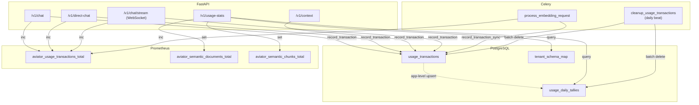
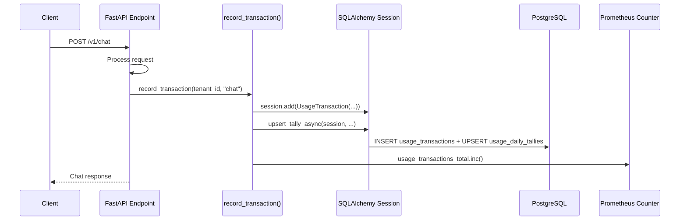

# Usage Tracking

Aviator ADT includes a built-in **usage tracking** system that records every API transaction (chat, chat via WebSocket, direct-chat, embedding, search) per tenant, aggregates them into daily tallies in application code via SQLAlchemy, and exposes a `/v1/usage-stats` endpoint for querying usage statistics over arbitrary date ranges.

## Architecture



### Database Schema

Each tenant schema (or `public`) contains two tracking tables created automatically on first use:

| Table | Purpose |
|---|---|
| `usage_transactions` | Detail rows — one per API call, with type, counts, and metadata |
| `usage_daily_tallies` | Aggregated daily counts per transaction type (maintained by application-level upsert) |

The `public.tenant_schema_map` table maps `tenant_id` → `schema_name` and is shared across the entire system.

#### usage_transactions

| Column | Type | Description |
|---|---|---|
| `id` | `BIGSERIAL` | Primary key |
| `transaction_type` | `TEXT` | One of: `chat`, `chat_ws`, `direct_chat`, `embedding_add`, `embedding_update`, `embedding_delete`, `search_query` |
| `document_count` | `INT` | Number of documents involved (embeddings) |
| `chunk_count` | `INT` | Number of chunks involved (embeddings) |
| `input_tokens` | `INT` | Aggregated prompt/input tokens for this request (LLM-backed transactions) |
| `output_tokens` | `INT` | Aggregated completion/output tokens for this request (LLM-backed transactions) |
| `llm_total_requests` | `INT` | Number of LLM calls made while serving this request |
| `metadata` | `JSONB` | Extensible metadata |
| `created_at` | `TIMESTAMPTZ` | Timestamp of the transaction |

#### usage_daily_tallies

| Column | Type | Description |
|---|---|---|
| `id` | `BIGSERIAL` | Primary key |
| `tally_date` | `DATE` | The date being tallied |
| `transaction_type` | `TEXT` | Transaction type |
| `total_count` | `INT` | Total number of transactions |
| `total_documents` | `INT` | Sum of document counts |
| `total_chunks` | `INT` | Sum of chunk counts |
| `input_tokens` | `INT` | Sum of `input_tokens` for that day/type |
| `output_tokens` | `INT` | Sum of `output_tokens` for that day/type |
| `llm_total_requests` | `INT` | Sum of LLM requests for that day/type |

A `UNIQUE (tally_date, transaction_type)` constraint ensures one row per day per type; the application-level upsert in `recorder.py` uses `SELECT ... FOR UPDATE` followed by an insert-or-update to increment.

### How It Works



#### Transaction Recording

Transactions are recorded **after** the main operation succeeds:

- **FastAPI endpoints** (`/v1/chat`, `/v1/direct-chat`, `/v1/context`) use `record_transaction()` — an async function that inserts into the tenant's `usage_transactions` table via SQLAlchemy async sessions.
- **WebSocket endpoint** (`/v1/chat/stream`) also uses `record_transaction()` with `transaction_type="chat_ws"` after each successful chat interaction.
- **Celery tasks** (embedding add/update/delete) use `record_transaction_sync()` — a synchronous variant using SQLAlchemy sync sessions.

Both functions are **fire-and-forget safe**: errors are logged but never propagated to avoid breaking the caller. When `usage_tracking_enabled` is `False`, they are no-ops.

For `chat`, `chat_ws`, and `direct_chat`, tracking includes aggregated `input_tokens`, `output_tokens`, and `llm_total_requests` captured from LLM during request execution. Non-LLM transaction types record these counters as `0`.

Every successful recording also increments the `aviator_usage_transactions_total` Prometheus counter, labelled by `tenant_id` and `transaction_type`.

#### Automatic Aggregation

Daily tally aggregation is performed **in application code** within the same database transaction as the detail row insert. Both `record_transaction()` and `record_transaction_sync()` call a `_upsert_tally` helper that:

1. Selects the `usage_daily_tallies` row for the current date and transaction type with `FOR UPDATE` locking
2. If a row exists, increments the counters
3. If no row exists, inserts a new tally row

This happens atomically within the same SQLAlchemy session transaction, keeping the tally table always up-to-date without relying on database-specific triggers.

#### Data Retention

A Celery beat task (`cleanup_usage_transactions`) runs daily at 02:00 UTC. It calls two cleanup functions:

1. **`cleanup_old_transactions()`** — Iterates all schemas from `tenant_schema_map` plus `public` and deletes `usage_transactions` rows older than `usage_tracking_retention_days` (default: 365) in batches of 10,000
2. **`cleanup_old_tallies()`** — Deletes `usage_daily_tallies` rows older than `usage_tracking_tally_retention_days` (default: 365) in batches of 10,000

Both functions use SQLAlchemy ORM sessions and batch deletes (selecting IDs first, then deleting by ID) to avoid long-running locks.

To keep tallies indefinitely (for long-term trend analysis), set `USAGE_TRACKING_TALLY_RETENTION_DAYS=0`.

## API Endpoint

### `GET /v1/usage-stats`

Returns usage statistics for a tenant over a date range, with zero-filled time-series buckets.

**Authentication:** Required (uses `require_authentication()`).

**Rate limit:** 15 requests/minute.

#### Query Parameters

| Parameter | Type | Default | Description |
|---|---|---|---|
| `tenant_id` | `string` | From auth context | Tenant to query |
| `units` | `"days" \| "months" \| "years"` | `"days"` | Time bucket granularity |
| `from_offset` | `int` (≤ 0) | — | Relative start offset from today in `units` (e.g., `-30`). Must be zero or negative |
| `to_offset` | `int` (≤ 0) | `0` (today) | Relative end offset from today in `units`. Must be zero or negative |
| `from_date` | `YYYY-MM-DD` | — | Absolute start date (inclusive, UTC). Must not be in the future |
| `to_date` | `YYYY-MM-DD` | — | Absolute end date (inclusive, UTC). Must not be in the future |

!!! note
    `from_offset` and `from_date` are mutually exclusive. Same for `to_offset`/`to_date`. Providing both returns a `400` error.
    All date parameters are restricted to today or the past — future dates are rejected with a `400` error.

#### Example Requests

```bash
# Last 30 days of usage
curl "http://localhost:3000/v1/usage-stats?from_offset=-30&units=days" \
  -H "auth-ticket: your-ticket"

# Monthly stats for a specific tenant over a date range
curl "http://localhost:3000/v1/usage-stats?tenant_id=acme&units=months&from_date=2025-01-01&to_date=2025-12-31" \
  -H "auth-ticket: your-ticket"

# Yearly overview
curl "http://localhost:3000/v1/usage-stats?units=years&from_offset=-3" \
  -H "auth-ticket: your-ticket"
```

#### Response Format

All response keys use **camelCase**, consistent with the rest of the API.

```json
{
  "tenantId": "acme",
  "timezone": "UTC",
  "units": "days",
  "from": "2025-12-01",
  "to": "2025-12-03",
  "data": [
    {
      "date": "2025-12-01",
      "chatCount": 15,
      "directChatCount": 3,
      "embeddingsRequestCount": 7,
      "chunksCount": 120,
      "documentsEmbeddedCount": 2,
      "chunksDeletedCount": 15,
      "documentsDeletedCount": 1,
      "semanticQueryCount": 5,
      "input_tokens": 5420,
      "output_tokens": 1830,
      "llm_total_requests": 22
    },
    {
      "date": "2025-12-02",
      "chatCount": 0,
      "directChatCount": 0,
      "embeddingsRequestCount": 0,
      "chunksCount": 0,
      "documentsEmbeddedCount": 0,
      "chunksDeletedCount": 0,
      "documentsDeletedCount": 0,
      "semanticQueryCount": 0,
      "input_tokens": 0,
      "output_tokens": 0,
      "llm_total_requests": 0
    },
    {
      "date": "2025-12-03",
      "chatCount": 8,
      "directChatCount": 1,
      "embeddingsRequestCount": 0,
      "chunksCount": 0,
      "documentsEmbeddedCount": 0,
      "chunksDeletedCount": 0,
      "documentsDeletedCount": 0,
      "semanticQueryCount": 2,
      "input_tokens": 1730,
      "output_tokens": 640,
      "llm_total_requests": 9
    }
  ],
  "semanticSize": {
    "documentsEmbeddedTotal": 45,
    "chunksTotal": 1230
  }
}
```

| Response Field | Description |
|---|---|
| `data[].chatCount` | Number of `/v1/chat` and `/v1/chat/stream` (WebSocket) chat requests |
| `data[].directChatCount` | Number of `/v1/direct-chat` requests |
| `data[].embeddingsRequestCount` | Total embedding operations (add + update + delete) |
| `data[].chunksCount` | Total chunks processed in embedding add/update operations |
| `data[].documentsEmbeddedCount` | Total documents embedded (add/update) |
| `data[].chunksDeletedCount` | Total chunks removed by delete operations |
| `data[].documentsDeletedCount` | Total documents removed by delete operations |
| `data[].semanticQueryCount` | Number of `/v1/context` semantic search queries |
| `data[].input_tokens` | Total LLM input tokens for chat and direct-chat requests in the bucket |
| `data[].output_tokens` | Total LLM output tokens for chat and direct-chat requests in the bucket |
| `data[].llm_total_requests` | Total number of LLM calls for chat and direct-chat requests in the bucket |
| `semanticSize.documentsEmbeddedTotal` | Current total documents in the vector store |
| `semanticSize.chunksTotal` | Current total chunks in the vector store |

#### Error Responses

| Status | Condition |
|---|---|
| `400` | Conflicting parameters or date range exceeds `usage_tracking_max_query_days` |
| `401` | Unauthorized |
| `501` | `usage_tracking_enabled` is `False` |

## Configuration

Usage tracking is controlled by the following settings (environment variables):

| Setting | Env Variable | Default | Description |
|---|---|---|---|
| `usage_tracking_enabled` | `USAGE_TRACKING_ENABLED` | `true` | Feature flag — set to `false` to disable all tracking and return `501` on `/v1/usage-stats` |
| `usage_tracking_max_query_days` | `USAGE_TRACKING_MAX_QUERY_DAYS` | `365` | Maximum date range span allowed in a single stats query |
| `usage_tracking_retention_days` | `USAGE_TRACKING_RETENTION_DAYS` | `365` | Days to retain detail transaction rows before the cleanup task deletes them |
| `usage_tracking_tally_retention_days` | `USAGE_TRACKING_TALLY_RETENTION_DAYS` | `365` | Days to retain daily tally rows before cleanup. Set to `0` to keep tallies indefinitely |
| `usage_tracking_pool_size` | `USAGE_TRACKING_POOL_SIZE` | `5` | Connection pool size for the dedicated usage tracking async DB pool |

### Disabling Usage Tracking

To disable tracking entirely:

```bash
export USAGE_TRACKING_ENABLED=false
```

When disabled:

- `record_transaction()` and `record_transaction_sync()` become no-ops
- The `/v1/usage-stats` endpoint returns `501 Not Implemented`
- No DB pool is created for usage tracking at startup
- The cleanup beat task still runs but does nothing (no schemas to clean)

!!! tip
    Usage tracking is automatically disabled in tests via `conftest.py` (`USAGE_TRACKING_ENABLED=false`) to avoid requiring a database connection.

## Tenant Isolation

Usage tracking follows the same tenant isolation model as the rest of ADT:

- Each tenant gets its own `usage_transactions` and `usage_daily_tallies` tables in their dedicated schema
- Schemas are created on-demand when the first transaction is recorded for a tenant
- A `tenant_schema_map` table in `public` maps `tenant_id` → `schema_name`
- Schema name collisions (two tenant IDs sanitizing to the same name) are resolved with a hash suffix
- If no `tenant_id` is provided, the `public` schema is used

```
tenant_id="acme"     → schema: tenant_acme
tenant_id=None       → schema: public
tenant_id="Acme Co!" → schema: tenant_acme_co_  (sanitized)
```

## Data Flow Summary

```
Chat/Direct-Chat/Context/WebSocket Request
  → FastAPI endpoint processes request
  → await record_transaction(tenant_id, type)
  → SQLAlchemy async session: INSERT usage_transactions + upsert usage_daily_tallies
  → Prometheus counter incremented
  → Response returned to client

Celery Embedding Task
  → process_embedding_request(...)
  → record_transaction_sync(tenant_id, type, doc_count, chunk_count)
  → SQLAlchemy sync session: INSERT usage_transactions + upsert usage_daily_tallies
  → Prometheus counter incremented

GET /v1/usage-stats?from_offset=-30&units=days
  → Resolve tenant from query param or auth context
  → Query usage_daily_tallies via SQLAlchemy (grouped by units in Python)
  → Compute semantic size from usage_daily_tallies (adds + updates − deletes)
  → Zero-fill missing buckets
  → Update Prometheus semantic size gauges
  → Return JSON response

Celery Beat (02:00 UTC daily)
  → cleanup_usage_transactions task
  → Batch-delete old usage_transactions rows
  → Batch-delete old usage_daily_tallies rows (if retention > 0)
```

## Prometheus Metrics

Usage tracking exposes three Prometheus metrics (defined in `metrics.py`):

| Metric | Type | Labels | Description |
|---|---|---|---|
| `aviator_usage_transactions_total` | Counter | `tenant_id`, `transaction_type` | Incremented on every recorded transaction |
| `aviator_semantic_documents_total` | Gauge | `tenant_id` | Updated when `/v1/usage-stats` is queried |
| `aviator_semantic_chunks_total` | Gauge | `tenant_id` | Updated when `/v1/usage-stats` is queried |

The counter is incremented in both `record_transaction()` and `record_transaction_sync()`. The gauges are set in the `/v1/usage-stats` endpoint handler with the latest semantic size snapshot.

## Key Design Decisions

| Decision | Rationale |
|---|---|
| Application-level tally aggregation | Daily tallies updated atomically in the same transaction as the detail insert; database-agnostic (no PL/pgSQL triggers) |
| SQLAlchemy ORM | Database-agnostic table definitions; `schema_translate_map` handles multi-tenant schema routing cleanly |
| Separate detail + tally tables | Detail rows support future drill-down; tallies are fast for reporting |
| Fire-and-forget recording | Tracking failures never break the primary API flow |
| Dedicated connection pool | Isolates tracking DB load from the main application pool (separate SQLAlchemy engines) |
| Sync + async engines | FastAPI uses async engine; Celery tasks use sync engine (created lazily) — both supported |
| Batch cleanup | Avoids long-running DELETE locks on large tables |
| Schema-per-tenant | Reuses existing multi-tenancy model for data isolation |
| Zero-filled buckets | API consumers get complete time series without gap handling |
| Prometheus metrics | Enables real-time monitoring without querying the database |
