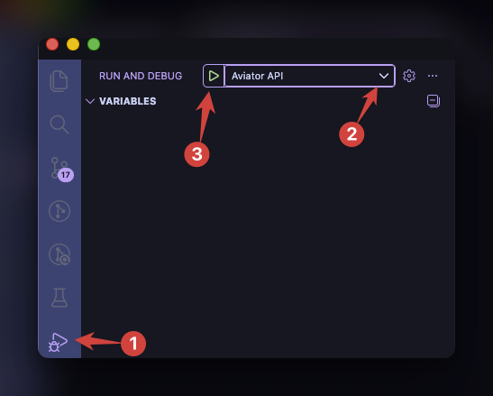

# Getting Started

This guide will help you set up and run the Aviator ADT locally. If you're looking to create a custom plugin for Aviator ADT, please refer to the [Plugin Development](dev/plugins.md) page.

## Requirements

### Credentials

You'll need a google credential JSON file like `otl-cs-csai.json` living in the root directory of the project. This is the credentials file for a Goole Service Account from a Google Cloud Platform (GCP) project. If you don't know how to get this, please reach out to us.

### Environment Variables

You'll need to setup at minimum these environment variables in a `.env` file

```env
GOOGLE_APPLICATION_CREDENTIALS=./NAME_OF_YOUR_CREDENTIALS_FILE.json
```

### Software

#### Windows WSL2 installation

The best development experience under Windows is achieved by using WSL2. You can find installation instructions here: [Install WSL2](https://learn.microsoft.com/de-de/windows/wsl/install)

If you are using WSL2 via VPN you must perform the following actions to solve DNS issues:

Perform the following steps **in the wsl container**:

- Update the `/ect/wsl.conf`

  ```conf /etc/wsl.conf
  [network]
  generateResolvConf = false
  ```

- Update the `/etc/resolv.conf`

  ```conf /etc/resolv.conf
  nameserver 10.255.255.254
  nameserver 10.145.114.4 # VPN DNS
  nameserver 10.145.114.5# VPN DNS
  ```

- Restart WSL

  ```sh
  wsl --shutdown
  ```

#### Common Steps for all Operating Settings

- [Visual Studio Code](https://code.visualstudio.com/)
- Docker Runtime with docker-compose, one of:
  1. [Rancher Desktop](https://docs.rancherdesktop.io/getting-started/installation) (OSS)
  2. [Docker Desktop](https://www.docker.com/get-started/) (License Required)

- uv (UltraViolet) - Python version and dependency management
  1. [Installation](https://docs.astral.sh/uv/getting-started/installation)
  2. [Intro video on Youtube](https://www.youtube.com/watch?v=6pttmsBSi8M)

#### Optional Software

If you want to build and start the chat interface locally:

- [npm](https://nodejs.org/en/download/)

----

## Run backend dependencies

Aviator requires background services like postgres with the pgvector-extenstion and a message broker like RabbitMQ or GooglePubSub

You can start a set of preconfigured backing services using docker-compose with the following command:

```sh
make up-backend
```

To spin up the dependencies using docker compose.

----

## Run application

There are multiple ways to start the application.
You can run the entire application including dependencies in your container runetime via

```sh
make up
```

If you want using Visual Studio to set breakpoints and debug, there are some launch configuration already defined so you simply run the `Aviator API` Run configuration.

### Debugging with Visual Studio Code

To debug the application using Visual Studio Code, you can use the predefined launch configurations. Open the `Run and Debug` panel and select the `Aviator API` configuration.



### Accessing the Application

In both cases the application is available under: [http://localhost:3000/docs](http://localhost:3000)

## Clean up application

If you used docker compose to deploy the application you can simply run to bring down the docker containers

```sh
make down
```
